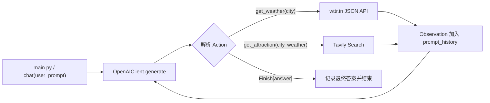
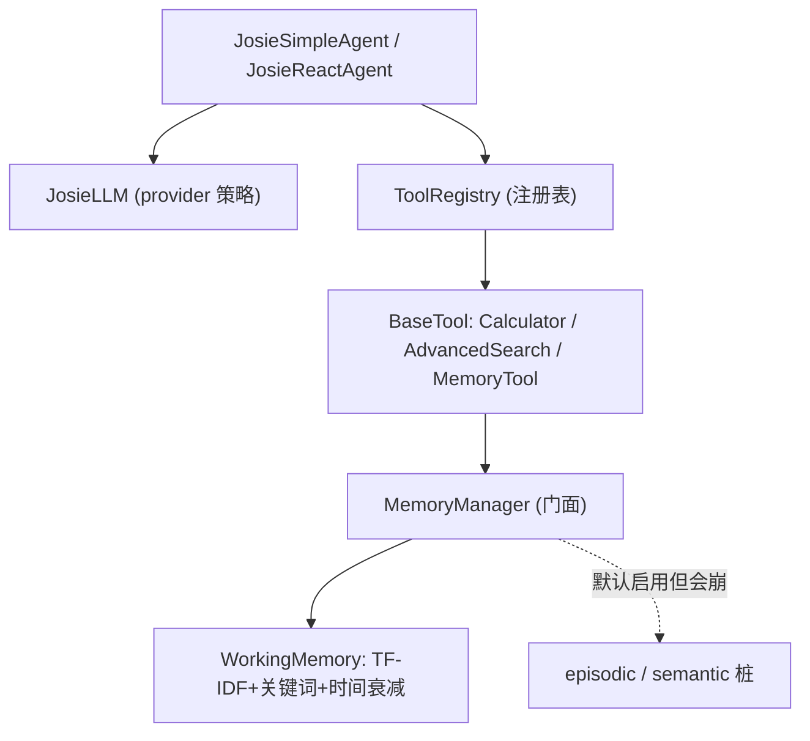
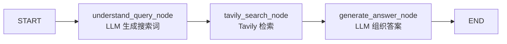

# AGENTS.md

本文件为在此仓库中工作的 Codex/Agent 提供基于当前源码的工程说明。不要把本仓库误认为单一的旅行助手应用：它是一个 Agent 与 LLM 基础实现的学习/实验集合，各目录拥有独立入口、依赖和配置。

## 项目定位

仓库包含八类相对独立的内容：

| 目录/入口 | 作用 | 当前状态 |
| --- | --- | --- |
| `main.py` + `simple_agent/` | MiniMax 驱动的旅行助手 ReAct 示例，调用天气与景点工具 | 顶层示例入口 |
| `hello_agent/` | 通用 LLM 客户端，以及 ReAct、Reflection、Plan-and-Solve 三种 Agent 演示 | 可分别直接运行模块 |
| `josie_agents/` | 从零手写的分层 Agent 框架：core/agents/tools/memory 四层 | 框架实验，working memory 最完整；长期记忆为桩 |
| `lang_graph/` | LangGraph + Tavily 的交互式搜索工作流 | 独立命令行示例 |
| `auto_gen/` | AutoGen RoundRobin 软件开发团队实验及其生成的 Streamlit 样例 | 旧版团队流程 |
| `autogen_team/` | 带文件工具和 SelectorGroupChat 的 AutoGen 团队，以及生成的汇率应用 | 新版团队流程 |
| `base_llm/`、`website/` | BPE/Transformer 教学实现与静态 gitmoji 页面 | 与 Agent 流程无直接耦合 |
| `env_crypto.sh`、`env_tools/` | 使用密码保护根目录 `.env` 的认证加密工具 | shell 留在根目录，实现与密文位于子目录 |

`README.md` 与 `CLAUDE.md` 当前仍只描述早期 `simple_agent` 示例，不能作为完整目录索引；改动前应以源码为准。

## 目录结构

```text
myAgent/
├── main.py
├── env_crypto.sh
├── env_tools/{encrypt.py,decrypt.py,env_crypto.py,.env_encrypt,tests/}
├── simple_agent/
│   ├── simple_agent/{agent_loop.py,prompt.py,available_tools.py}
│   ├── llm/llm.py
│   ├── tools/{get_weather.py,get_attraction.py}
│   └── logger.py
├── hello_agent/
│   ├── llm_client/llm_client.py
│   ├── react_agent/react_agent.py
│   ├── reflection_agent/reflection_agent.py
│   ├── plan_and_solve_agent/{plan_and_solve_agent.py,planner.py,solver.py}
│   ├── tools/search.py
│   ├── tools_executor/tools_executor.py
│   ├── memory/memory.py
│   └── prompt/
├── josie_agents/                 # 无 __init__.py，从根以 josie_agents.* 导入
│   ├── ARCHITECTURE.md           # 本模块详细架构与设计模式文档
│   ├── core/{base_llm.py,josie_llm.py,message.py,config.py}
│   ├── agents/{base_agent.py,josie_react_agent.py,josie_simple_agent.py,test_react_agent.py}
│   ├── tools/{base_tool.py,registry.py,tool_chain_manager.py,async_tool_executor.py,builtin/}
│   ├── memory/{base.py,manager.py,types/{working.py,episodic.py,semantic.py,perceptual.py}}
│   └── utils/log.py
├── lang_graph/{dialogue_system.py,workflow.py,node.py,state.py,requirements.txt}
├── auto_gen/{software_team.py,user_terminal.py,requirements.txt,output/}
├── autogen_team/{software_team.py,user_terminal.py,tools/,utils/,requirements.txt,exchange_app/}
├── base_llm/{BPE.py,transformer.py}
├── website/{index.html,run.sh}
└── pyproject.toml
```

## 核心流程

### `simple_agent` 旅行助手

`main.py` 以固定的杭州旅行问题调用 `simple_agent.simple_agent.agent_loop.chat()`。循环最多执行 8 轮；模型必须输出 `Thought:` 与 `Action:`，其中 Action 是工具调用或 `Finish[...]`。



关键契约：

- 工具注册表位于 `simple_agent/simple_agent/available_tools.py`。
- 工具 Action 参数解析仅接受双引号形式的命名参数，例如 `get_weather(city="杭州")`。
- `get_weather()` 使用 `https://wttr.in/{city}?format=j1`，不需要 API key。
- `get_attraction()` 使用 `TAVILY_API_KEY`，优先返回 Tavily 的 `answer`。

### `hello_agent` 演示族

`HelloAgentsLLM` 是共用 OpenAI 兼容客户端，采用流式响应；不同示例不共享运行状态：

| 入口 | 流程 | 额外服务 |
| --- | --- | --- |
| `python -m hello_agent.react_agent.react_agent` | `Thought/Action` 循环，最多 5 步，注册 `Search[...]` 工具 | SerpApi |
| `python -m hello_agent.reflection_agent.reflection_agent` | 初始生成 -> 反思 -> 改写，默认最多 3 次 | 无额外工具 |
| `python -m hello_agent.plan_and_solve_agent.plan_and_solve_agent` | Planner 生成 Python list 计划，Solver 顺序执行 | 无额外工具 |

### `josie_agents` 自研 Agent 框架

从零手写的分层框架，依赖方向单向向下 `agents → tools → memory` 与 `agents → core`，与仓库其它实验**完全解耦**。详细设计模式、记忆检索算法、扩展点与风险见 `josie_agents/ARCHITECTURE.md`，此处仅给最小索引。



关键契约：

- **抽象主线**：`BaseAgent` / `BaseTool` / `BaseMemory` / `BaseLLM` 均为模板方法基类，子类只填具体步骤。
- **工具入参约定不一致**：`ToolRegistry.execute_tool` 只能给工具传 `{"input": str}`；`MemoryTool.run` 却要求含 `action` 的字典，须由 `JosieSimpleAgent` 特判绕开。新增工具优先兼容 `{"input": str}`。
- **记忆检索**：`WorkingMemory.retrieve` 用字符级 TF-IDF(`char_wb`,1-4gram) + 关键词 + 每 30 分钟时间衰减 + 重要性权重；但 `MemoryManager.retrieve_memories` 合并后**仅按 importance 排序**，会覆盖相关性分数。
- **provider 选择**：`JosieLLM` 默认 `provider="minimax"`，按 provider 读不同环境变量；`default` 分支走 `LLM_*`。
- ReAct Action 格式 `工具名[参数]` 或 `Finish[答案]`（`max_steps=5`）；SimpleAgent 工具协议 `[TOOL_CALL:name:params]`（`max_tool_iterations=3`）。

### `lang_graph` 搜索助手

状态载体是 `SearchState`；`messages` 使用 `add_messages` 累积，其他字段记录搜索中间产物。工作流是固定的线性图，并由 `InMemorySaver` 以 `thread_id` 保存会话状态。



入口为 `python -m lang_graph.dialogue_system`，交互命令 `quit`、`q`、`退出` 或 `exit` 结束会话。

### AutoGen 团队与生成应用

- `auto_gen/software_team.py` 使用 `RoundRobinGroupChat`，团队成员固定轮流发言；`auto_gen/output/` 保存已生成的 Streamlit 示例应用。
- `autogen_team/software_team.py` 使用 `SelectorGroupChat`，顺序由阶段完成短语驱动，并将 PRD、源码和说明文件写入 `Path(project) / biz`。
- `autogen_team/tools/file_tools.py` 将写入文件名限制为 basename，但使用模块级 `WORK_DIR`；调用保存/读取工具前必须先调用 `init_output_dirs()`。
- `autogen_team/exchange_app/` 是现存汇率应用产物，不是团队框架本身。

不要将生成应用和生成器的职责混在一起修改：修复团队生成流程时改 `auto_gen/` 或 `autogen_team/`；修复现有页面行为时改对应的 `output/` 或 `exchange_app/` 产物。

## 配置与依赖

### 环境变量

| 变量 | 使用模块 | 用途 |
| --- | --- | --- |
| `MINIMAX_API_KEY` | `simple_agent` | 旅行助手的 OpenAI 兼容客户端认证 |
| `MINIMAX_BASE_URL` | `simple_agent` | 旅行助手模型服务地址 |
| `MINIMAX_MODEL` | `simple_agent` | 旅行助手模型名称 |
| `LLM_API_KEY` | `hello_agent`、`lang_graph`、`auto_gen`、`autogen_team`、`josie_agents`(default provider) | 通用 OpenAI 兼容客户端认证 |
| `LLM_BASE_URL` | 同上 | 通用模型服务地址 |
| `LLM_MODEL_ID` | 同上 | 通用模型标识 |
| `LLM_TIMEOUT` | `hello_agent` | 可选超时秒数，默认 `60` |
| `MINIMAX_MODEL_ID` | `josie_agents`(minimax provider) | `JosieLLM` 默认 provider 的模型名（注意与 `simple_agent` 的 `MINIMAX_MODEL` 不同名） |
| `MODELSCOPE_API_KEY` / `OLLAMA_*` / `VLLM_*` | `josie_agents` | `JosieLLM` 对应 provider 的凭证与地址 |
| `TAVILY_API_KEY` | `simple_agent`、`lang_graph`、`josie_agents` | Tavily 检索认证 |
| `SERPAPI_API_KEY` | `hello_agent/react_agent`、`josie_agents` | Google 搜索工具认证 |

所有密钥只能放在本地 `.env` 或进程环境中，不要写入源码、文档示例或提交记录。

### 本地环境文件加密

`env_crypto.sh` 是保留在根目录的直接运行入口，可交互选择操作或接受 `encrypt`/`decrypt` 参数，并明确使用项目的 `uv` 环境，不受调用终端已激活的其他虚拟环境影响。Python 实现与密文均位于 `env_tools/`：`encrypt.py` 从终端读取并二次确认密码，将根目录 `.env` 加密后原子覆盖写入 `env_tools/.env_encrypt`；`decrypt.py` 读取密码，将认证成功的 `env_tools/.env_encrypt` 原子覆盖解密到根目录 `.env`。协议使用 `scrypt` 派生 256 位密钥与 `AES-GCM` 认证加密，密码错误或文件被篡改时不会覆盖目标文件。

```bash
./env_crypto.sh
./env_crypto.sh encrypt
./env_crypto.sh decrypt
```

`.env` 必须保持在忽略列表中；提交 `env_tools/.env_encrypt` 前仍应确认团队确实需要共享密文，且密码通过代码仓库之外的渠道管理。

### 依赖事实

- 根 `pyproject.toml` 当前声明 Python `>=3.14`、加密工具所需的 `cryptography`，以及 `josie_agents` 所需的 `openai`、`pydantic`、`scikit-learn`、`tavily`、`serpapi`、`python-dotenv` 等；其余实验依赖仍未集中声明，不能单独完成完整仓库安装。
- `josie_agents` 无独立 requirements，依赖根 `pyproject.toml`；`memory/types/working.py` 的检索依赖 `scikit-learn`（`TfidfVectorizer` / `cosine_similarity`，缺失时回退纯关键词）。
- `lang_graph/requirements.txt` 声明 LangGraph 示例依赖。
- `auto_gen/requirements.txt` 与 `autogen_team/requirements.txt` 声明 AutoGen/Streamlit 示例依赖；其中现有 `dotenv` 条目与源码导入的 `python-dotenv` 包名可能需要校正后才能在新环境安装。
- `simple_agent` 与 `hello_agent` 暂无独立 requirements 文件；其源码实际依赖 `openai`、`python-dotenv`、`requests`、`tavily-python` 或 `google-search-results`。
- `base_llm/transformer.py` 依赖 `torch`；`base_llm/BPE.py` 仅用标准库。

## 常用运行入口

从仓库根目录执行，以保证包导入路径一致：

```bash
python main.py
python -m hello_agent.react_agent.react_agent
python -m hello_agent.reflection_agent.reflection_agent
python -m hello_agent.plan_and_solve_agent.plan_and_solve_agent
python -m josie_agents.agents.josie_simple_agent
python -m josie_agents.agents.test_react_agent
python -m josie_agents.memory.types.test_working_memory
python -m lang_graph.dialogue_system
python -m auto_gen.user_terminal
python -m autogen_team.user_terminal
python base_llm/BPE.py
python base_llm/transformer.py
python3 -m http.server 8084 --directory website
```

已生成的 Web 应用分别从其目录运行：

```bash
streamlit run auto_gen/output/btc/app.py
streamlit run auto_gen/output/exchange/exchange_rate_app.py
streamlit run autogen_team/exchange_app/app.py
```

## 已知风险

这些是当前代码的真实限制。涉及相应模块时，优先修掉根因，不要在新逻辑上继续堆补丁。

1. `simple_agent` 的工具 Action 解析直接对正则匹配结果调用 `.group()`；畸形模型输出可能引发异常，而不是转化为 Observation。
2. 多个入口会发出真实外部 API 请求并调用收费或受配额约束的 LLM/搜索服务；测试时不要误当成纯单元测试。
3. `autogen_team` 文件工具依赖全局 `WORK_DIR` 且会覆盖同名产物文件；执行生成流程前必须确认输出目录，避免破坏人工修改的应用。
4. `auto_gen/output/` 与 `autogen_team/exchange_app/` 中的汇率/趋势展示包含演示或模拟数据语义，不能默认视为金融级实时数据。
5. `josie_agents` 的 `EpisodicMemory` / `SemanticMemory` / `PerceptualMemory` 未继承 `BaseMemory` 却调用 `super().__init__(config, storage_backend)`，运行时会 `TypeError`；而 `MemoryManager` / `MemoryTool` 默认启用 episodic + semantic，**默认构造即崩溃**。可用方式是显式只启用 working（`MemoryManager(enable_episodic=False, enable_semantic=False)` 或 `MemoryTool(memory_types=["working"])`）。

## 修改原则

- 先确认修改属于哪个独立实验，不要为了复用而把不同 Agent 框架强行耦合。
- 保持现有公开入口、Action 格式、状态字段和生成文件路径兼容；若必须改变，连同调用方与文档一起更新。
- 新增环境读取统一使用项目本地 `.env` 或调用方传参，不再引入绝对用户路径。
- 网络调用增加超时与错误处理；涉及 LLM 输出时，把解析失败作为普通失败路径处理。
- 修改 `autogen_team` 生成逻辑时，明确验证生成器及其产物中哪一侧需要同步更新。

## 验证清单

根据改动范围选择最小但真实的验证：

| 改动范围 | 至少验证 |
| --- | --- |
| 纯文档/静态页面 | 检查 diff；页面变更时本地打开 `website/` |
| `simple_agent`/`hello_agent` 解析与工具注册 | 对有效与无效 Action 做无网络测试；需要联网的调用单独说明 |
| `josie_agents` 记忆/工具/Agent | 跑 `python -m josie_agents.memory.types.test_working_memory`（仅 working，无需 LLM）；改记忆算法验证衰减/容量/淘汰边界；改 Agent/LLM 的联网调用单独说明 |
| `lang_graph` 状态或节点 | 验证状态字段完整、图可编译；真实 Tavily/LLM 调用需具备密钥 |
| AutoGen 团队逻辑 | 使用临时输出目录验证文件写入边界，避免覆盖现存产物 |
| Streamlit 产物 | 启动对应 `streamlit run ...` 并检查主要交互 |
| `base_llm` | 运行受影响脚本或针对张量形状/掩码增加最小测试 |

没有配置 API key 时，要明确标注未执行真实联网验证，不要假装已通过。
