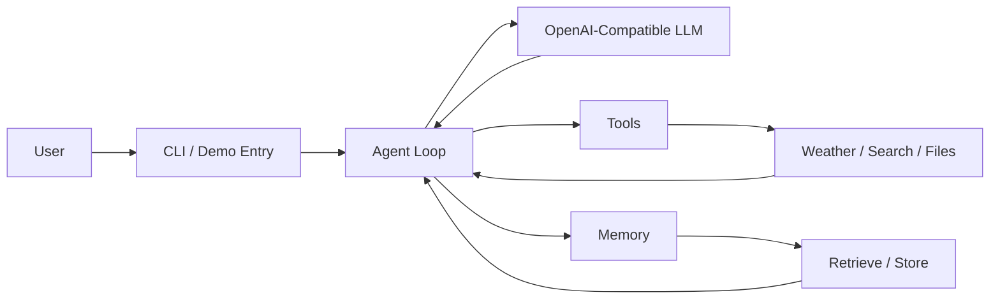
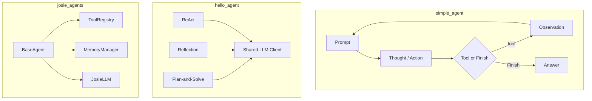
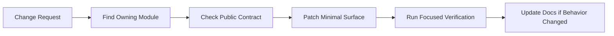

# myAgent

<p align="center">
  <strong>A hands-on laboratory for building agents, LLM clients, memory systems, tool execution, LangGraph workflows, and AutoGen teams.</strong>
</p>

<p align="center">
  <a href="https://www.python.org/"></a>
  <a href="https://github.com/features/actions"></a>
  <a href="https://react-lm.github.io/"></a>
  <a href="https://www.langchain.com/langgraph"></a>
</p>

---

## What This Repo Is

`myAgent` is not one monolithic assistant. It is a collection of independent experiments for learning how modern agents are built from the ground up:

- OpenAI-compatible LLM clients
- ReAct, Reflection, and Plan-and-Solve agents
- tool registries and tool execution loops
- working memory retrieval with scoring and decay
- LangGraph search workflows
- AutoGen software-team simulations
- small teaching implementations for BPE and Transformer internals
- local `.env` encryption utilities

The useful mental model is: **one repository, many small agent systems**.



## Project Map

| Area | Path | Purpose | Status |
| --- | --- | --- | --- |
| Travel ReAct demo | `main.py`, `simple_agent/` | MiniMax-powered travel assistant with weather and attraction tools | runnable demo |
| Agent patterns | `hello_agent/` | ReAct, Reflection, Plan-and-Solve examples over a shared LLM client | runnable demos |
| Custom framework | `josie_agents/` | layered agent framework with core, agents, tools, and memory modules | active experiment |
| Search workflow | `lang_graph/` | LangGraph + Tavily command-line search assistant | independent demo |
| AutoGen round-robin | `auto_gen/` | older multi-agent software-team workflow and generated Streamlit apps | legacy experiment |
| AutoGen selector team | `autogen_team/` | selector-based team with file tools and an exchange-rate generated app | newer experiment |
| LLM internals | `base_llm/` | BPE and Transformer teaching code | learning module |
| Static site | `website/` | simple gitmoji-style static page | static demo |
| Secrets tooling | `env_crypto.sh`, `env_tools/` | password-protected local `.env` encryption/decryption | local utility |

## Repository Layout

```text
myAgent/
├── main.py
├── simple_agent/          # MiniMax ReAct travel assistant
├── hello_agent/           # ReAct, Reflection, Plan-and-Solve demos
├── josie_agents/          # custom layered agent framework
├── lang_graph/            # LangGraph search workflow
├── auto_gen/              # AutoGen RoundRobin team experiment
├── autogen_team/          # AutoGen SelectorGroupChat experiment
├── base_llm/              # BPE and Transformer learning code
├── website/               # static demo site
├── env_crypto.sh          # shell entry for .env encryption tooling
├── env_tools/             # encryption implementation and ciphertext
└── pyproject.toml
```

## Quick Start

Clone the repo, create an environment, install dependencies, and run the smallest demo:

```bash
git clone <your-repo-url>
cd myAgent

uv sync
python main.py
```

If you do not use `uv`, create a Python environment manually and install the packages declared in `pyproject.toml`.

## Runbook

Run commands from the repository root so imports resolve consistently.

```bash
# Simple travel ReAct assistant
python main.py

# hello_agent demos
python -m hello_agent.react_agent.react_agent
python -m hello_agent.reflection_agent.reflection_agent
python -m hello_agent.plan_and_solve_agent.plan_and_solve_agent

# josie_agents demos
python -m josie_agents.agents.josie_simple_agent
python -m josie_agents.agents.test_react_agent
python -m josie_agents.memory.types.test_working_memory

# LangGraph search assistant
python -m lang_graph.dialogue_system

# AutoGen team demos
python -m auto_gen.user_terminal
python -m autogen_team.user_terminal

# LLM internals
python base_llm/BPE.py
python base_llm/transformer.py

# Static website
python3 -m http.server 8084 --directory website
```

Generated Streamlit apps:

```bash
streamlit run auto_gen/output/btc/app.py
streamlit run auto_gen/output/exchange/exchange_rate_app.py
streamlit run autogen_team/exchange_app/app.py
```

## Environment Variables

Keep secrets in a local `.env` file or process environment. Do not commit raw API keys.

| Variable | Used By | Description |
| --- | --- | --- |
| `MINIMAX_API_KEY` | `simple_agent` | MiniMax authentication |
| `MINIMAX_BASE_URL` | `simple_agent` | MiniMax OpenAI-compatible endpoint |
| `MINIMAX_MODEL` | `simple_agent` | MiniMax model name |
| `MINIMAX_MODEL_ID` | `josie_agents` | default Josie MiniMax model id |
| `LLM_API_KEY` | `hello_agent`, `lang_graph`, `auto_gen`, `autogen_team`, `josie_agents` | generic OpenAI-compatible API key |
| `LLM_BASE_URL` | same as above | generic OpenAI-compatible endpoint |
| `LLM_MODEL_ID` | same as above | generic model id |
| `TAVILY_API_KEY` | `simple_agent`, `lang_graph`, `josie_agents` | Tavily search |
| `SERPAPI_API_KEY` | `hello_agent`, `josie_agents` | SerpApi search |
| `MODELSCOPE_API_KEY` | `josie_agents` | ModelScope provider |
| `OLLAMA_*`, `VLLM_*` | `josie_agents` | local or self-hosted model providers |

## Secret Encryption

The repository includes a small utility for encrypting and decrypting the root `.env` file.

```bash
./env_crypto.sh
./env_crypto.sh encrypt
./env_crypto.sh decrypt
```

The encrypted payload is stored under `env_tools/.env_encrypt`. Share the password outside the repository.

## Agent Patterns



## Known Sharp Edges

- Some demos call real LLM or search APIs. Expect network latency, quotas, and billing constraints.
- `README.md` is an overview; each experiment remains independent and should not be coupled casually.
- `simple_agent` expects strict ReAct action formatting.
- `josie_agents` long-term memory modules are still experimental; working memory is the most complete path.
- `auto_gen/output/` and `autogen_team/exchange_app/` contain generated applications. Avoid mixing generator changes with generated-app fixes.

## Development Rule

Before changing code, identify which experiment owns the behavior. Fix the root module, keep public entry points compatible, and validate the smallest real path that exercises the change.



## License

No license file is currently declared. Add one before publishing or accepting external contributions.
