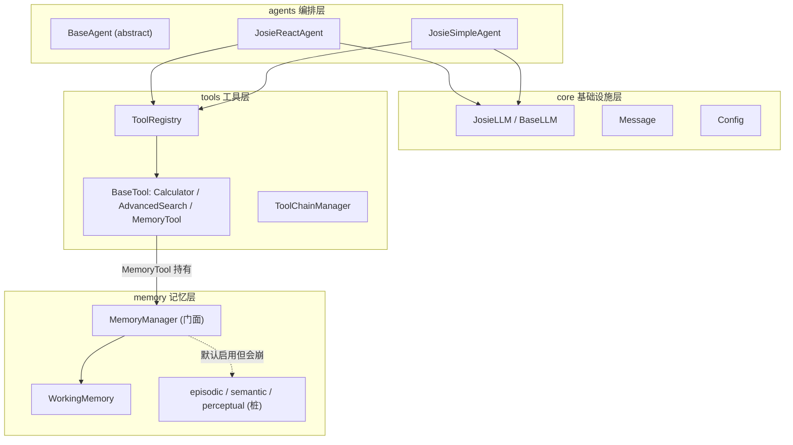
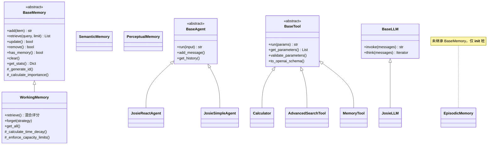
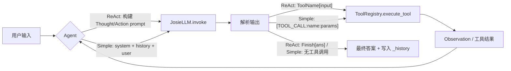
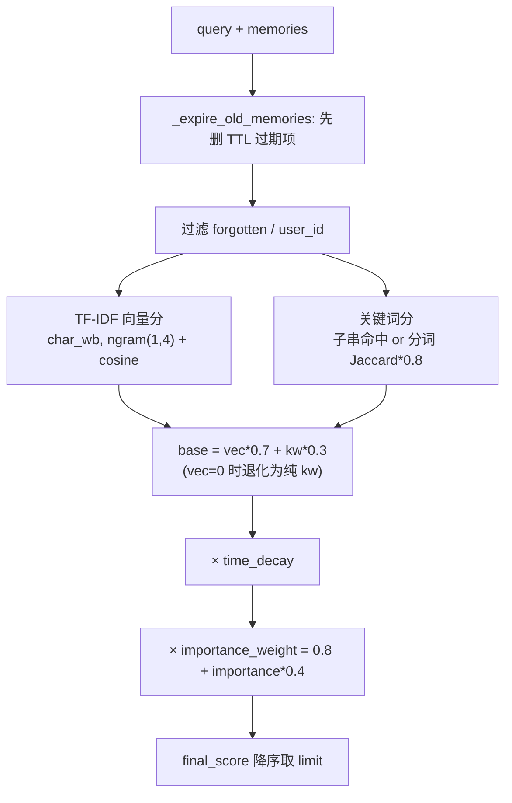

# josie_agents 架构与设计模式

本文件基于源码（仓库 `josie_agents/` 全部 `.py` 文件）整理，描述这个**从零手写的 Agent 框架实验**的分层结构、核心抽象、设计模式与数据流。它与仓库内 `simple_agent`、`hello_agent` 等其它实验**完全解耦**，可独立阅读。

> 阅读约定：本文档以源码为唯一事实来源。`README.md` / `CLAUDE.md` 未覆盖本模块，不要据其推断。

## 1. 项目定位

`josie_agents` 不是一个产品，而是一套**自研的 Agent 基础设施骨架**：自己实现 LLM 客户端、工具系统、记忆系统和 Agent 编排，用来理解「一个 Agent 框架的各层如何拼装」。

成熟度分层（重要，决定能不能直接跑）：

| 层 | 状态 |
| --- | --- |
| `core`（LLM 客户端 / Message / Config） | ✅ 可用 |
| `tools`（注册表 / 内置工具 / 工具链 / 异步执行） | ✅ 可用 |
| `agents`（ReAct / Simple 两种 Agent） | ✅ 可用 |
| `memory` → `WorkingMemory` | ✅ 可用，逻辑最完整 |
| `memory` → `Episodic / Semantic / Perceptual` | 🔴 仅占位桩，**默认配置下会在构造期崩溃**（见 §8） |

## 2. 目录结构

```text
josie_agents/                 # 注意：无 __init__.py，从仓库根以 josie_agents.* 导入
├── core/                     # 基础设施层
│   ├── base_llm.py           # BaseLLM：OpenAI 兼容客户端（invoke 非流式 / think 流式）
│   ├── josie_llm.py          # JosieLLM：按 provider 分支的多厂商适配
│   ├── message.py            # Message（pydantic）
│   └── config.py             # Config（Agent 级配置）
├── agents/                   # 编排层
│   ├── base_agent.py         # BaseAgent 抽象
│   ├── josie_react_agent.py  # ReAct：Thought/Action 循环
│   ├── josie_simple_agent.py # 对话 + [TOOL_CALL:...] 协议
│   └── test_react_agent.py   # ReAct 集成测试入口
├── tools/                    # 工具层
│   ├── base_tool.py          # BaseTool 抽象 + ToolParameter
│   ├── registry.py           # ToolRegistry 注册表
│   ├── tool_chain_manager.py # ToolChain / ToolChainManager 顺序管道
│   ├── async_tool_executor.py# 线程池并行执行
│   └── builtin/
│       ├── calculator.py     # AST 安全表达式求值
│       ├── advanced_search.py# Tavily + SerpApi 多源搜索
│       └── memory_tool.py    # 把 MemoryManager 暴露为工具
├── memory/                   # 记忆层
│   ├── base.py               # MemoryItem / MemoryConfig / BaseMemory
│   ├── manager.py            # MemoryManager 门面
│   └── types/
│       ├── working.py        # WorkingMemory（完整实现）
│       ├── episodic.py       # 桩
│       ├── semantic.py       # 桩
│       ├── perceptual.py     # 桩
│       └── test_working_memory.py  # 记忆系统最完整的行为说明
└── utils/
    └── log.py                # ANSI 彩色日志
```

不存在：包级 `__init__.py`、独立 `requirements.txt`、`prompt/` 子包（ReAct 模板内嵌在 `josie_react_agent.py`）。

## 3. 分层架构总览



依赖方向单向向下：`agents → tools → memory`、`agents → core`。各层只依赖下层抽象，不反向依赖。

## 4. 核心抽象与继承关系



三条抽象主线都用**模板方法**：基类定义流程与通用辅助（如 `BaseMemory._generate_id` / `_calculate_importance`，`BaseTool.validate_parameters` / `to_openai_schema`），子类只填具体步骤。

### 关键数据模型（`core/` 与 `memory/base.py`）

| 模型 | 关键字段 |
| --- | --- |
| `MemoryItem` | `id, content, memory_type, user_id, timestamp, importance=0.5, metadata={}` |
| `Message` | `content, role∈{user,assistant,system,tool}, timestamp, metadata`；`to_dict()` 出 OpenAI 格式 |
| `Config`（Agent 级） | `default_model, default_provider, temperature, max_tokens, debug, log_level, max_history_length`；`from_env()` |
| `ToolParameter` | `name, type, description, required, default` |
| `MemoryConfig` | 见 §7 |

注意 `Config`（Agent 配置）与 `MemoryConfig`（记忆配置）是**两个独立的类**，不要混用。

## 5. 设计模式落点

| 模式 | 体现位置 |
| --- | --- |
| **模板方法 (Template Method)** | `BaseAgent.run` / `BaseTool.run` / `BaseMemory` 全套抽象接口；基类编排，子类实现 |
| **策略 (Strategy)** | `JosieLLM` 按 `provider`（minimax/modelscope/ollama/vllm/default）分支选凭证与 client；`WorkingMemory.forget(strategy=...)`；`MemoryManager._classify_memory_type` 关键词分类；`AdvancedSearchTool` 多源顺序尝试 |
| **注册表 (Registry)** | `ToolRegistry`：`register_tool` / `register_function` / `execute_tool` / `get_tools_description`；`ToolChainManager.chains` |
| **门面 (Facade)** | `MemoryManager` 把多类型记忆统一成 `add_memory / retrieve_memories / consolidate_memories / forget_memories`；`MemoryTool.execute` 再把它路由成工具 action |
| **管道 / 责任链 (Pipeline)** | `ToolChain.add_step` + `execute`，用 `input_template.format(**context)` 在步骤间传递 `{input}`、`{step_result}` |
| **适配器 (Adapter)** | `BaseLLM` / `JosieLLM` 把多厂商 API 适配为统一的 OpenAI `chat.completions` 调用 |
| **组合 (Composition)** | `MemoryTool` 持有 `MemoryManager`；Agent 注入 `ToolRegistry`；`ToolChainManager` 持有 `ToolRegistry` |
| **工厂式辅助** | `create_advanced_search_registry()`、`create_calculate_chain()`（便捷构造函数，非完整抽象工厂） |

未使用单例、观察者/事件总线；`MemoryTool.auto_record_conversation` 只是便捷写入方法，不是订阅模型。

## 6. 数据流

### 6.1 Agent 主回路



两种 Agent 的差异：

- **`JosieReactAgent`**：显式 Thought/Action 循环，`max_steps=5`；Action 格式 `工具名[参数]` 或 `Finish[答案]`；用 `current_history: List[str]` 累积 Action/Observation 文本；`_parse_output` 会先剥离 `<think>...</think>`。
- **`JosieSimpleAgent`**：普通对话，工具协议 `[TOOL_CALL:name:params]`，`max_tool_iterations=3`；检测到工具调用就执行并把结果回灌为下一轮 user 消息；支持 `stream_run`。

### 6.2 工具调用约定（容易踩坑）

`ToolRegistry.execute_tool(name, input_text)` 对所有 Tool 对象**统一传 `{"input": input_text}`**。因此：

- `Calculator` / `AdvancedSearch` 的 `run()` 直接取 `parameters['input']` —— 与注册表约定一致。
- `MemoryTool.run()` 要求 `parameters` 含 `action` —— **走注册表的 `execute_tool` 会因缺 `action` 报参数校验失败**。所以 `JosieSimpleAgent._execute_tool_call` 对非 `Calculator` 工具改走 `tool.run(param_dict)`，并用 `_parse_tool_parameters` 把 `key=value,key=value` 解析成字典；`memory` 工具默认补成 `{action: search, query: ...}`。

这是当前一个**抽象泄漏**：注册表的「字符串入参」约定与 `MemoryTool` 的「字典 action」接口不兼容，靠 Agent 层特判绕开。

## 7. 记忆系统机制（重点：WorkingMemory）

### 7.1 MemoryManager 门面

- 构造：`enable_working/episodic/semantic/perceptual` 开关决定实例化哪些类型，写入 `memory_types` 字典。
- `add_memory`：可选 `auto_classify`（按关键词把内容分到 episodic/semantic/working）；`importance` 缺省时由 `_calculate_importance` 估算（长度 + 关键词加权）。
- `retrieve_memories`：按类型平分 `per_type_limit = max(1, limit // len(types))`，合并后**仅按 `importance` 降序**返回。
- `consolidate_memories`：从源类型取 `get_all()`，把高重要性项 `remove` 后 `add` 到目标类型（重要性 ×1.1）。
- `forget_memories`：对实现了 `forget()` 的类型委托（目前只有 working）。

> ⚠️ 设计取舍提醒：`WorkingMemory.retrieve` 内部算出的混合 relevance 分数**只用于本类型内排序**，到了 manager 层会被「按 importance 排序」覆盖。跨类型检索时相关性信息丢失。

### 7.2 WorkingMemory.retrieve 混合评分算法



逐项说明：

1. **向量侧实为字符级 TF-IDF，不是 embedding 模型**：`TfidfVectorizer(analyzer='char_wb', ngram_range=(1,4))` + `cosine_similarity`。用字符 n-gram 是为了规避「中文无空格 → word tokenizer 把整段汉字当成单 token」的问题。导入/计算失败时回退纯关键词。
2. **关键词分**：query 是 content 子串 → `len(query)/len(content)`；否则按空格分词做 Jaccard 并 ×0.8。
3. **混合**：`vector_score>0` → `0.7*vec + 0.3*kw`，否则 `= kw`。
4. **时间衰减**：`decay_factor ** (秒数 / 1800)`，即**每 30 分钟衰减一档**（底数默认 0.95），下限 0.1。
5. **重要性权重**：`0.8 + importance*0.4`，最终 `final = base_relevance * importance_weight`。

### 7.3 容量与淘汰

| 机制 | 方法 | 规则 |
| --- | --- | --- |
| TTL 过期 | `_expire_old_memories` | `timestamp < now - working_memory_ttl_minutes`，删除并重建堆 |
| 条数上限 | `_enforce_capacity_limits` | `len > working_memory_capacity`（默认 10） |
| token 上限 | 同上 | `current_tokens > working_memory_tokens`（按 `content.split()` 计词） |
| 淘汰谁 | `_remove_lowest_priority_memory` | 小顶堆 `(priority, timestamp, item)`，`priority = importance * time_decay`，弹堆顶并跳过 stale 项 |
| 显式遗忘 | `forget(strategy)` | 先做 TTL，再按 `importance_based` / `time_based` / `capacity_based` |

`add()` 流程：先 TTL 清理 → 计算 priority 入堆 + append 列表 → 累加 token → enforce 容量。

### 7.4 MemoryConfig 配置字段（`memory/base.py`）

| 字段 | 默认 | 含义 |
| --- | --- | --- |
| `storage_path` | `"./memory_data"` | 预留，working 当前**纯内存不落盘** |
| `max_capacity` | `100` | 仅统计展示 |
| `importance_threshold` | `0.1` | 统计 / 遗忘参考 |
| `decay_factor` | `0.95` | 每 30 分钟指数衰减底数 |
| `working_memory_capacity` | `10` | 最大条数 |
| `working_memory_tokens` | `2000` | 最大词数 |
| `working_memory_ttl_minutes` | `120` | 存活分钟数 |
| `perceptual_memory_modalities` | `["text","image","audio","video"]` | 感知记忆（未实现） |

## 8. 已知风险（改动相关模块前必读）

1. **桩类型会崩**：`EpisodicMemory` / `SemanticMemory` / `PerceptualMemory` **没有继承 `BaseMemory`**，却在 `__init__` 里调用 `super().__init__(config, storage_backend)` → 落到 `object.__init__`，运行时 `TypeError`。而 `MemoryManager` 默认 `enable_episodic=True, enable_semantic=True`，`MemoryTool` 默认 `memory_types=["working","episodic","semantic"]`。**结论：直接 `MemoryManager()` 或 `MemoryTool()` 会在构造期抛异常**。可用配置是显式只启用 working（与 `test_working_memory.py` 一致）：

```python
MemoryManager(enable_episodic=False, enable_semantic=False)
# 或
MemoryTool(memory_types=["working"])
```

2. **检索相关性丢失**：`MemoryManager.retrieve_memories` 合并后只按 `importance` 排序，覆盖了 working 的混合相关性分数（见 §7.1）。
3. **注册表/工具接口不一致**：`ToolRegistry.execute_tool` 只能给工具传 `{"input": str}`，`MemoryTool` 需要 `action` 字典，须由 Agent 特判绕开（见 §6.2）。
4. **真实外部调用**：LLM 与搜索工具会发真实网络请求并消耗配额；测试不是纯单测。
5. **Calculator 仅支持 `+ - * /` 与 `sqrt`/`pi`**：`%`、`**`、负号一元运算等未覆盖，失败返回固定文案而非抛错。

## 9. 入口与运行

从**仓库根目录**运行（保证 `josie_agents.*` 导入路径）：

```bash
python -m josie_agents.agents.josie_simple_agent       # Simple Agent 四组测试
python -m josie_agents.agents.test_react_agent         # ReAct 集成测试
python -m josie_agents.memory.types.test_working_memory# 工作记忆（仅 working）
python -m josie_agents.core.josie_llm                  # LLM 直连演示
python -m josie_agents.tools.builtin.calculator        # 计算器
python -m josie_agents.tools.builtin.advanced_search   # 搜索
python -m josie_agents.tools.tool_chain_manager        # 工具链
python -m josie_agents.tools.async_tool_executor       # 并行工具
```

`MemoryTool` 调用约定：

```python
memory_tool.run({
    "action": "add|search|summary|stats|update|remove|forget|consolidate|clear_all",
    "content": "...", "query": "...",
    "memory_type": "working", "limit": 4,
})
```

## 10. 依赖与环境变量

| 用途 | 库 / 服务 |
| --- | --- |
| LLM | `openai` + `python-dotenv` |
| 数据模型 | `pydantic` |
| 记忆检索 | `scikit-learn`（`TfidfVectorizer` / `cosine_similarity`）+ `numpy` |
| 搜索 | `tavily`、`serpapi` |
| 标准库 | `heapq`、`uuid`、`ast`、`asyncio`、`concurrent.futures` |

环境变量（按 provider）：

| 变量 | 消费方 |
| --- | --- |
| `LLM_API_KEY` / `LLM_BASE_URL` / `LLM_MODEL_ID` | `BaseLLM` 默认分支 |
| `MINIMAX_API_KEY` / `MINIMAX_BASE_URL` / `MINIMAX_MODEL_ID` | `JosieLLM(provider="minimax")`（默认 provider） |
| `MODELSCOPE_API_KEY` | modelscope |
| `OLLAMA_*` / `VLLM_*` | 本地 provider |
| `TAVILY_API_KEY` / `SERPAPI_API_KEY` | `AdvancedSearchTool` |
| `DEBUG` / `LOG_LEVEL` / `TEMPERATURE` / `MAX_TOKENS` | `Config.from_env()` |

## 11. 扩展点

- **加工具**：继承 `BaseTool`，实现 `run` + `get_parameters`，`ToolRegistry.register_tool` 注册。注意 §6.2 的入参约定。
- **加记忆类型**：**完整**继承 `BaseMemory` 实现全部抽象方法（别学桩类），再在 `MemoryManager` 注册；若要参与 `forget` 需实现 `forget()`，参与 `consolidate` 需实现 `get_all()`。
- **加 Agent**：继承 `BaseAgent` 实现 `run`，按需注入 `ToolRegistry`。
- **加 LLM provider**：在 `JosieLLM.__init__` 增加 `provider` 分支，或走 `default` 分支用 `LLM_*` 环境变量。
