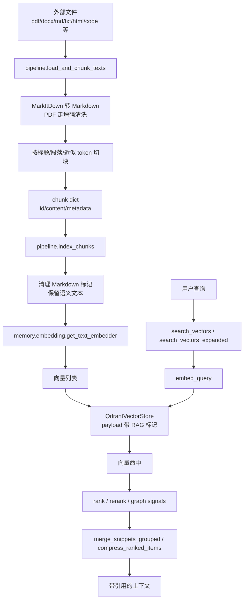
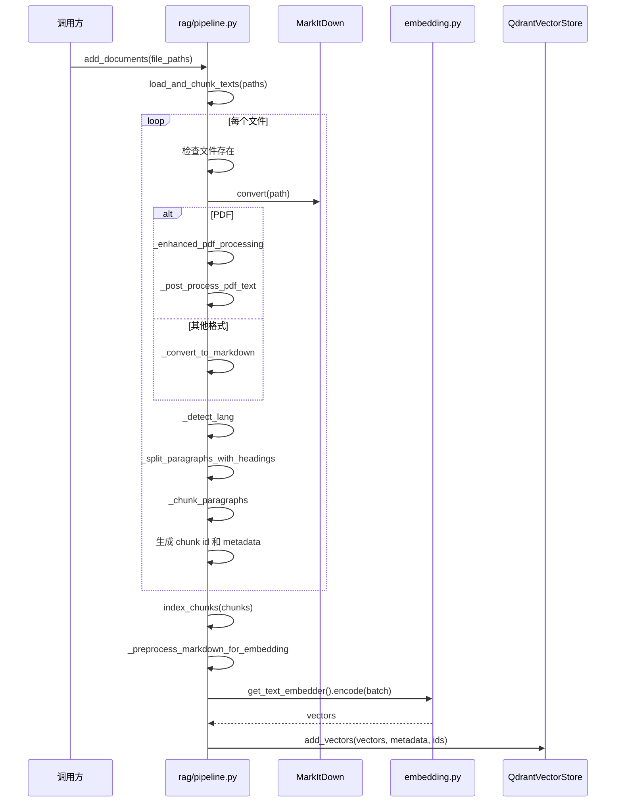
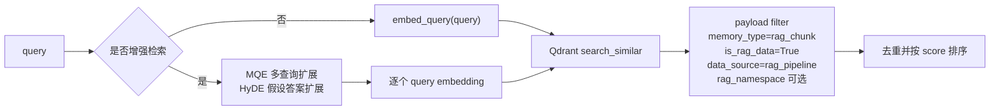
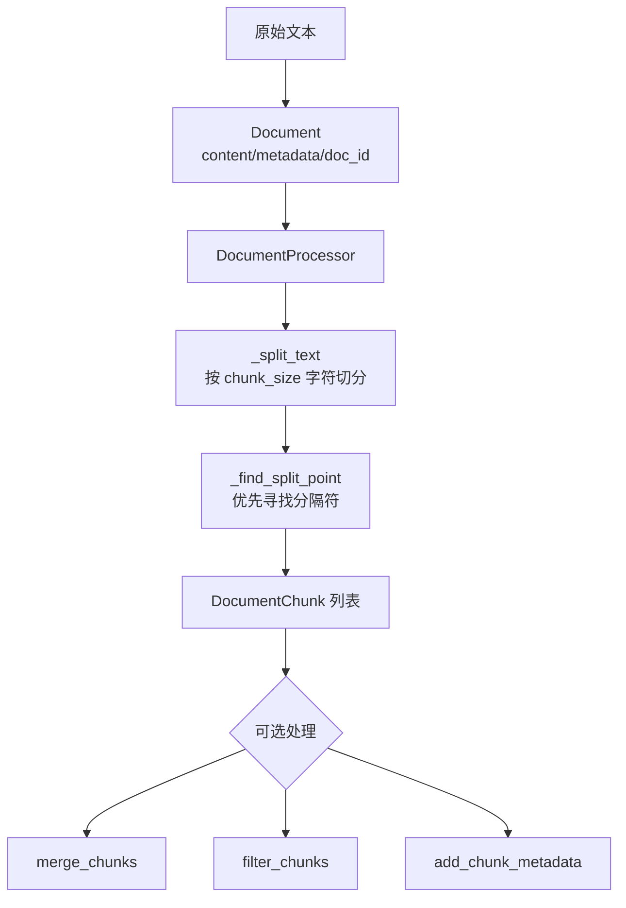
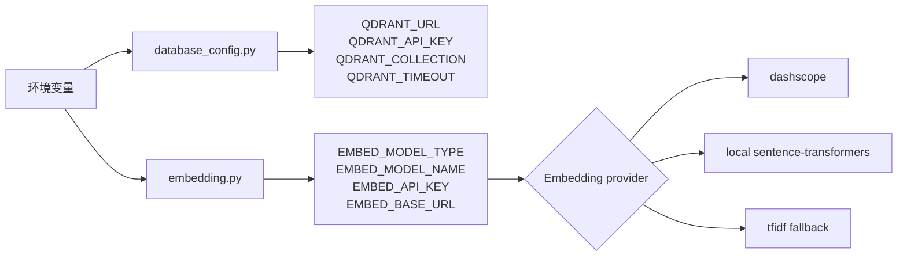
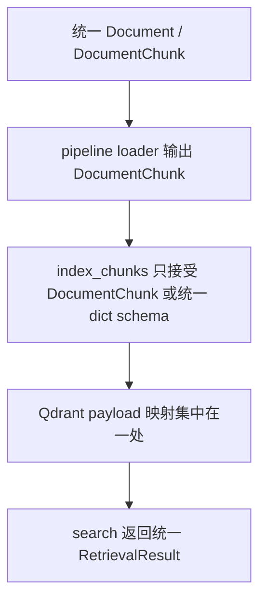

# RAG Pipeline 与 Document 流程架构说明

## 核心判断

`rag/pipeline.py` 是当前真正的 RAG 主流程：负责文件读取、Markdown 化、结构化切块、Embedding、写入 Qdrant、向量检索、可选查询扩展、重排、上下文合并和摘要。

`rag/document.py` 是独立的轻量文档模型与字符切块工具：定义 `Document`、`DocumentChunk`、`DocumentProcessor`，但当前没有被 `pipeline.py` 调用。

这意味着现在不是一个干净的单一文档处理架构，而是两套切块逻辑并存。能跑，但味道一般。真正的主线在 `pipeline.py`。

## 模块边界

| 文件 | 职责 | 当前地位 |
| --- | --- | --- |
| `pipeline.py` | RAG 端到端流程，直接处理外部文件、向量化、存储、检索和上下文组织 | 主流程 |
| `document.py` | 文档数据结构和基础字符切块器 | 辅助工具，当前未接入主流程 |
| `memory/embedding.py` | 统一 Embedding provider，支持 DashScope、本地模型、TF-IDF fallback | `pipeline.py` 依赖 |
| `memory/storage/qdrant_store.py` | Qdrant 向量存储封装，负责集合、索引、写入、搜索 | `pipeline.py` 依赖 |
| `core/database_config.py` | 从环境变量读取 Qdrant/Neo4j 配置 | 默认 store 创建依赖 |

## 总体架构



## 索引流程

入口有两个层次。

低层入口是：

```python
load_and_chunk_texts(paths, chunk_size=800, chunk_overlap=100, namespace=None)
index_chunks(store, chunks, rag_namespace="default")
```

高层入口是：

```python
pipeline = create_rag_pipeline(...)
pipeline["add_documents"](file_paths)
```

实际流程如下：



每个 chunk 写入 Qdrant 时，payload 会带这些关键字段：

| 字段 | 作用 |
| --- | --- |
| `memory_id` | chunk 的逻辑 ID |
| `memory_type` | 固定为 `rag_chunk`，用于检索过滤 |
| `content` | 原始 chunk 内容 |
| `data_source` | 固定为 `rag_pipeline` |
| `is_rag_data` | 固定为 `True` |
| `rag_namespace` | RAG 命名空间 |
| `source_path` | 源文件路径 |
| `doc_id` | 文档 ID |
| `start` / `end` | chunk 在文本中的字符范围 |
| `heading_path` | Markdown 标题路径 |
| `lang` | 检测语言 |

## 查询流程

普通检索入口：

```python
search_vectors(store, query, top_k=8, rag_namespace=None)
```

增强检索入口：

```python
search_vectors_expanded(
    store,
    query,
    enable_mqe=True,
    enable_hyde=True,
)
```

高层封装入口：

```python
pipeline = create_rag_pipeline(...)
pipeline["search"](query)
pipeline["search_advanced"](query, enable_mqe=True, enable_hyde=True)
```



检索结果还可以继续走后处理：

| 函数 | 作用 |
| --- | --- |
| `rerank_with_cross_encoder` | 使用 CrossEncoder 对候选结果重排 |
| `compute_graph_signals_from_pool` | 根据同文档密度和相邻距离计算图信号，不依赖 Neo4j |
| `rank` | 合并向量分数和图信号，默认 `0.7 * vector + 0.3 * graph` |
| `expand_neighbors_from_pool` | 从同文档候选池补相邻 chunk |
| `compress_ranked_items` | 合并同文档相近片段，限制每篇文档数量 |
| `merge_snippets` | 简单拼接上下文 |
| `merge_snippets_grouped` | 按文档聚合上下文，并生成 References |
| `tldr_summarize` | 调用 `JosieLLM` 做摘要 |

## `document.py` 的流程

`document.py` 更像一个通用基础设施，而不是当前 RAG 主流程的一部分。



主要对象：

| 对象 | 字段 | 行为 |
| --- | --- | --- |
| `Document` | `content`, `metadata`, `doc_id` | 未传 `doc_id` 时用内容 MD5 生成 |
| `DocumentChunk` | `content`, `metadata`, `chunk_id`, `doc_id`, `chunk_index` | 未传 `chunk_id` 时用 `doc_id + chunk_index + 内容前 50 字符` 生成 |
| `DocumentProcessor` | `chunk_size`, `chunk_overlap`, `separators` | 按字符长度切块，优先在段落、换行、句号、空格处分割 |

便捷函数：

| 函数 | 作用 |
| --- | --- |
| `load_text_file(file_path, encoding="utf-8")` | 读取纯文本文件并包装成 `Document` |
| `create_document(content, **metadata)` | 直接从字符串创建 `Document` |

## 两套切块逻辑的差异

| 维度 | `pipeline.py` | `document.py` |
| --- | --- | --- |
| 输入 | 文件路径列表 | `Document` 对象或纯文本 |
| 文件格式 | 依赖 MarkItDown，支持 PDF/Office/图片/音频/HTML/代码等 | 只处理已经读入的文本 |
| 切块单位 | 近似 token，保留标题路径和段落结构 | 字符长度 |
| 元数据 | `source_path/doc_id/lang/start/end/heading_path/namespace` 等 | `doc_id/chunk_index/total_chunks/processed_at` |
| 去重 | 按 chunk 内容 hash 去重 | 无去重 |
| 存储 | 可直接写 Qdrant | 不负责存储 |
| 当前接入状态 | 主流程 | 未被主流程使用 |

## 配置与外部依赖



关键外部依赖：

| 依赖 | 用途 |
| --- | --- |
| `markitdown` | 多格式文档转 Markdown |
| `langdetect` | 文本语言检测 |
| `sentence_transformers.CrossEncoder` | 可选重排 |
| `qdrant-client` | 向量数据库 |
| `dashscope` / `sentence-transformers` / `sklearn` | Embedding provider |
| `JosieLLM` | MQE、HyDE、TLDR 摘要 |

## 主要风险

1. `document.py` 和 `pipeline.py` 有重复切块职责，数据结构不统一。继续堆功能会让调用方不知道该用哪套。
2. `pipeline.py` 的函数太多，索引、检索、重排、摘要、PDF 清洗全部挤在一个文件里。能用，但维护成本会上升。
3. `index_chunks` 在 embedding 失败时会写零向量兜底。实用，但会污染检索质量；至少应该在统计或日志里可见。
4. Qdrant 点 ID 如果不是合法 UUID，会在 `QdrantVectorStore.add_vectors` 中被替换成随机 UUID；逻辑 ID 只能依赖 payload 的 `memory_id`。
5. `create_rag_pipeline` 直接 new `QdrantVectorStore`，而默认低层流程用 `QdrantConnectionManager`。连接管理策略不一致。
6. 增强检索依赖 `JosieLLM`，没有 API key 或模型不可用时会静默 fallback 到原查询，调用方需要知道这不是强保证。

## 建议收敛方向

真正该做的是先统一数据结构，而不是继续添加 helper。



最小改法：

1. 保留 `pipeline.py` 作为现有兼容入口，不破坏调用方。
2. 让 `load_and_chunk_texts` 的输出 schema 与 `DocumentChunk` 对齐，至少字段名和 ID 语义统一。
3. 把 Qdrant payload 构造收敛成一个函数，避免索引字段分散。
4. 明确 `document.py` 是公共文档模型，还是删掉不用。两套并存是复杂度来源。

