# EpisodicMemory 交互流程分析

基于现有信息，我理解需求是：把 `EpisodicMemory` 的真实交互路径讲清楚，包括 `self` 上各组件之间怎么协作、它和 storage 层怎么交互、每个 public/private 方法的调用路径是什么，并用 Mermaid 流程图落到同目录文档里。

## 核心判断

值得分析。原因很简单：`EpisodicMemory` 表面是一个记忆类型，实际同时维护内存缓存、SQLite 权威库、Qdrant 向量索引、外部 `storage_backend` 四套状态。这里最容易出错的不是算法，而是数据所有权不清。

关键洞察：

- 数据结构：`Episode` 是运行期缓存记录；`MemoryItem` 是对外协议；SQLite `memories` 表是当前代码注释里的“权威存储”；Qdrant 只是语义检索索引。
- 复杂度：`self.storage` 不是主存储，只被 `_persist_episode()` 和 `_remove_from_storage()` 两个私有方法使用，而主流程根本不调用它。
- 风险点：`has_memory()`、`get_all()`、`get_stats()` 依赖 `self.episodes`，重启后如果不从 SQLite 回灌内存缓存，这些方法就会和权威库脱节。

## 组件关系

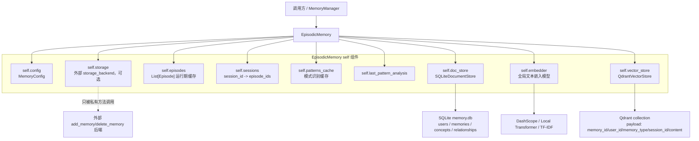

## 数据所有权

`add()` 写入顺序是先内存，再 SQLite，再 Qdrant。注释说 SQLite 是权威库，这个判断基本合理，但代码没有在初始化时从 SQLite 恢复 `self.episodes`。所以运行时看起来是三份数据：

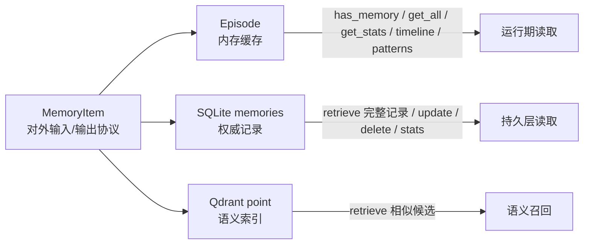

坏味道在这里：权威库和缓存之间没有恢复、同步校验、事务边界。SQLite 写失败时，内存已经被追加；Qdrant 写失败会被吞掉。这不是灾难，但别假装它强一致。

## 初始化流程

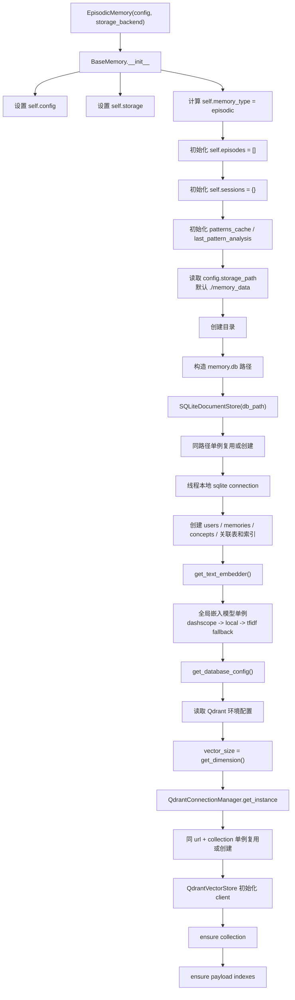

## Storage 层交互

### SQLiteDocumentStore

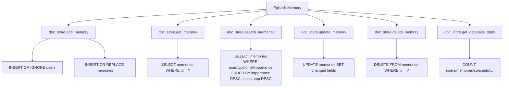

### QdrantVectorStore

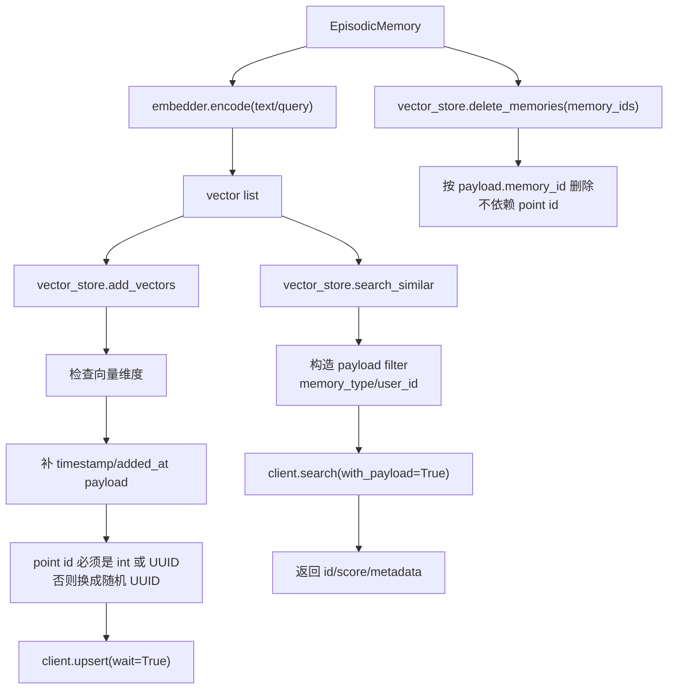

这里的设计有个正确选择：删除向量按 payload `memory_id` 做，不依赖 Qdrant point id。因为写入时非 UUID 字符串会被换成随机 UUID，靠 point id 删除会破坏用户空间。

## 方法交互路径

### add(memory_item)

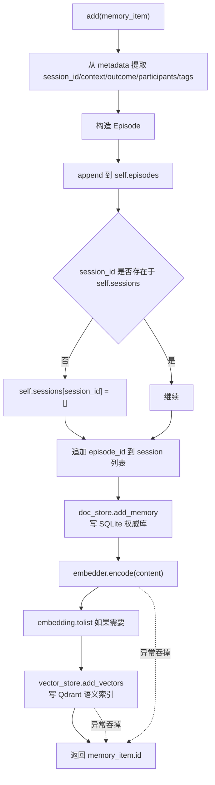

风险：

- SQLite 写入不在 `try` 里，失败会抛出；但失败发生前内存缓存已经追加，状态会脏。
- Qdrant 写入失败被吞掉，检索会失去语义召回，但 SQLite 记录仍存在。

### retrieve(query, limit, **kwargs)

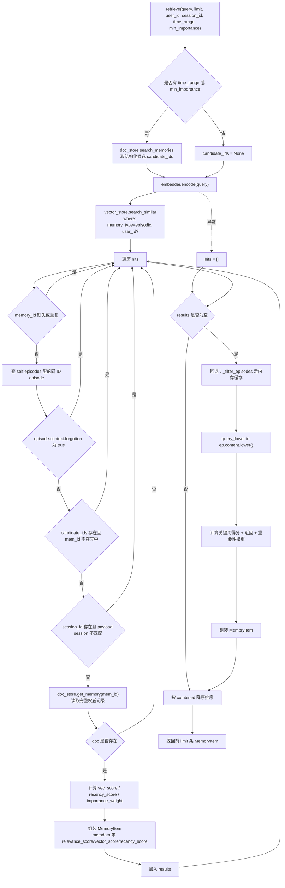

风险：

- 如果 Qdrant 不可用，只回退内存缓存，不回退 SQLite 全文/结构化搜索。重启后缓存空，SQLite 有数据也检索不到。
- `forgotten` 检查还留着软删除痕迹，但 `forget()` 已经是硬删除。这个分支是历史包袱。

### update(memory_id, content, importance, metadata)

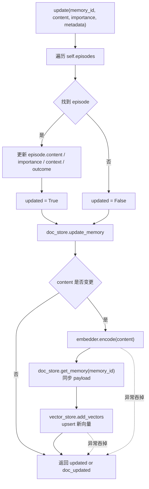

风险：

- 只更新 `importance` 时不会同步 Qdrant payload 里的 `importance`，向量索引 metadata 可能变旧。
- SQLite 的 `properties` 被整体替换为 `metadata`，但内存里只合并 `metadata.context` 和 `outcome`。两边语义不一致。

### remove(memory_id)

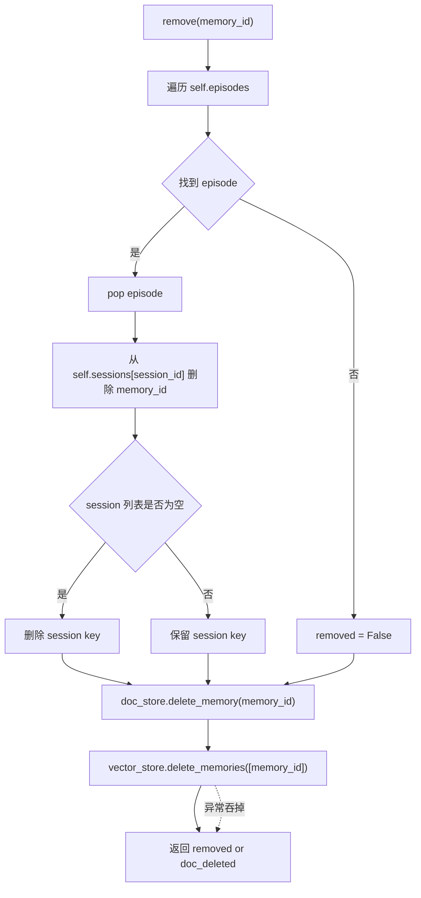

### clear()

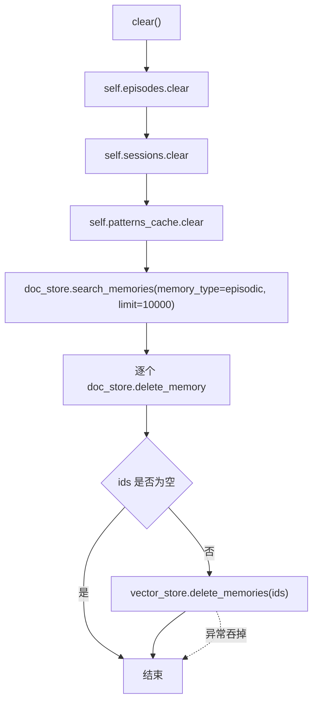

风险：先清内存，再清 SQLite。如果 SQLite 删除失败，内存和权威库立刻分裂。

### forget(strategy, threshold, max_age_days)

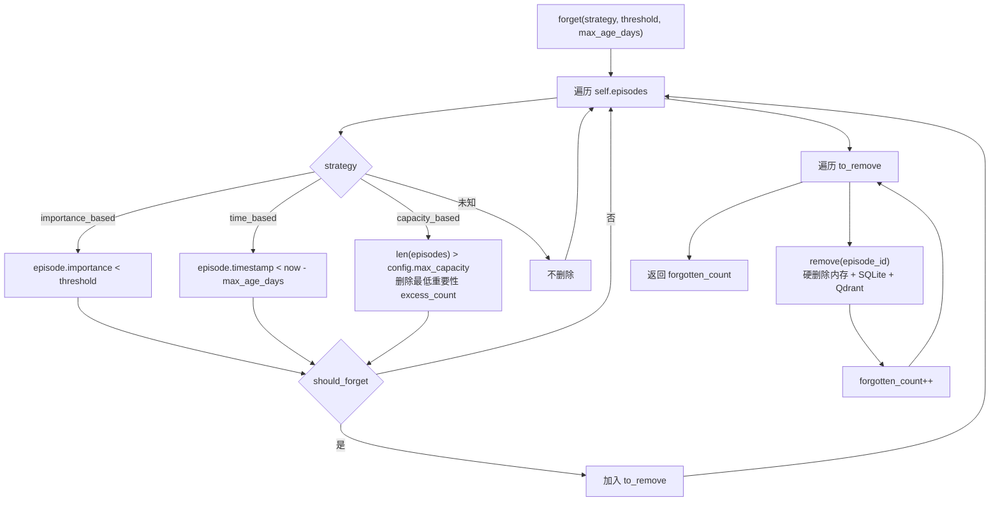

### has_memory(memory_id)

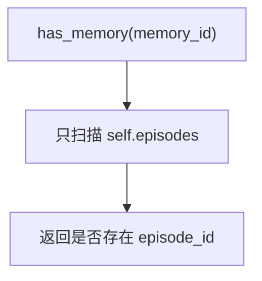

风险：它不查 SQLite。重启后没有回灌缓存，`has_memory()` 会把持久层存在的记忆判断为不存在。

### get_all()

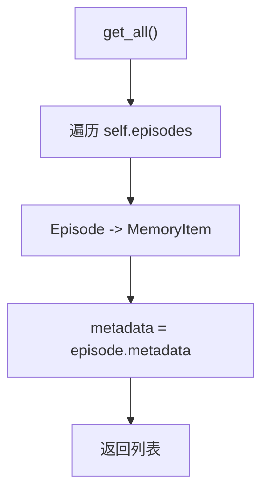

致命问题：`Episode` 没有 `metadata` 字段，这个方法运行到第一条记录就会 `AttributeError`。这不是风格问题，是直接坏。

### get_stats()

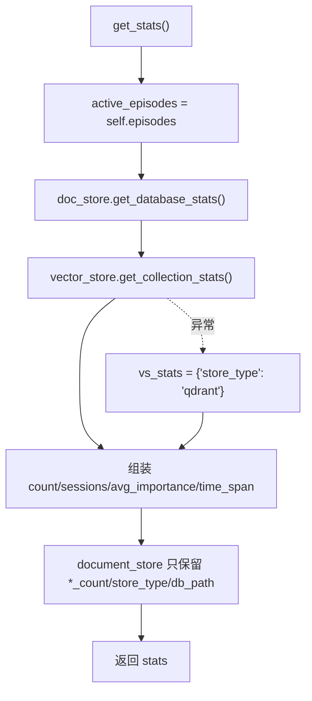

这里统计的是“缓存状态 + 持久层统计”的混合物。`count` 来自缓存，`document_store.memories_count` 来自 SQLite。两者不一致时没有任何告警。

### get_session_episodes(session_id)

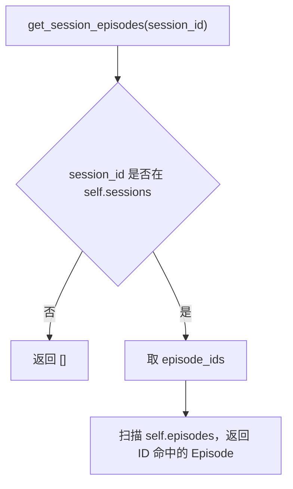

### find_patterns(user_id, min_frequency)

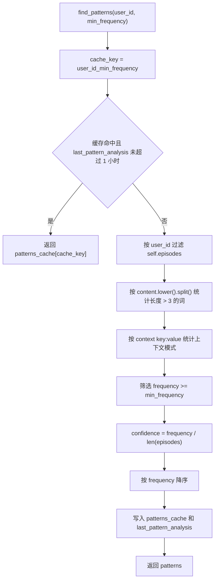

致命问题：`(datetime.now() - self.last_pattern_analysis).hours` 不存在，`timedelta` 没有 `hours` 属性。缓存命中路径会崩。应该用 `total_seconds() < 3600`。

### get_timeline(user_id, limit)

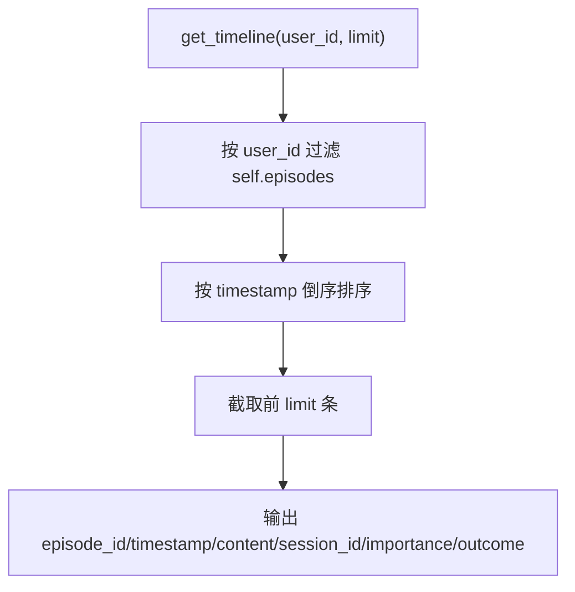

### _filter_episodes(user_id, session_id, time_range)

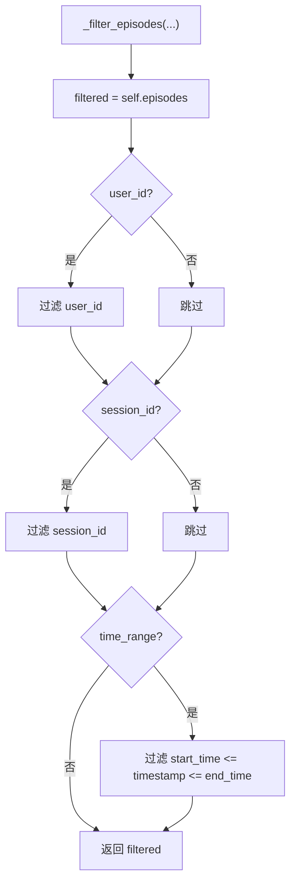

### _persist_episode(episode) 与 _remove_from_storage(memory_id)

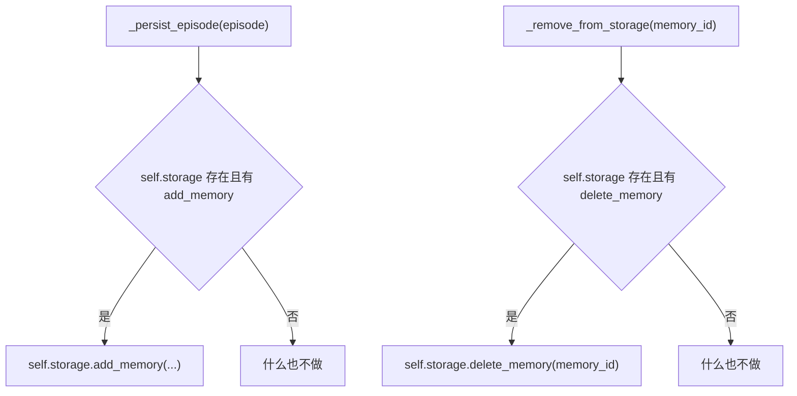

这两个方法是“外部 storage_backend 适配钩子”，但 `add()`、`remove()`、`clear()`、`forget()` 都没有调用它们。也就是说，当前主流程里的 storage 不是 `self.storage`，而是 `self.doc_store` 和 `self.vector_store`。

## 与 MemoryManager 的入口关系

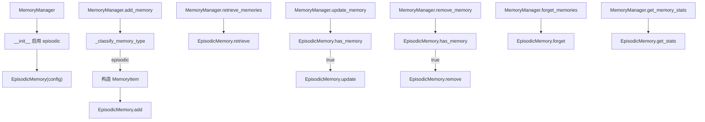

这里 `MemoryManager.update_memory()` 和 `remove_memory()` 依赖 `has_memory()` 找类型，而 `has_memory()` 只看内存缓存。这意味着持久层里存在但缓存里没有的 episodic 记忆，Manager 无法更新或删除。

## 完整主流程总图

```mermaid
flowchart TB
    subgraph Entry["入口"]
        AddEntry["add"]
        RetrieveEntry["retrieve"]
        UpdateEntry["update"]
        RemoveEntry["remove"]
        ClearEntry["clear"]
        ForgetEntry["forget"]
        ReadEntry["get_all / get_stats / timeline / patterns / session"]
    end

    subgraph Runtime["运行期缓存"]
        Episodes["self.episodes"]
        Sessions["self.sessions"]
        PatternCache["self.patterns_cache"]
    end

    subgraph Durable["持久层"]
        SQLite["SQLiteDocumentStore<br/>memory.db"]
        Qdrant["QdrantVectorStore<br/>semantic index"]
        Embedder["Text Embedder"]
        ExternalStorage["self.storage<br/>仅私有钩子"]
    end

    AddEntry --> Episodes
    AddEntry --> Sessions
    AddEntry --> SQLite
    AddEntry --> Embedder
    Embedder --> Qdrant

    RetrieveEntry --> SQLite
    RetrieveEntry --> Embedder
    RetrieveEntry --> Qdrant
    RetrieveEntry --> Episodes

    UpdateEntry --> Episodes
    UpdateEntry --> SQLite
    UpdateEntry --> Embedder
    UpdateEntry --> Qdrant

    RemoveEntry --> Episodes
    RemoveEntry --> Sessions
    RemoveEntry --> SQLite
    RemoveEntry --> Qdrant

    ClearEntry --> Episodes
    ClearEntry --> Sessions
    ClearEntry --> PatternCache
    ClearEntry --> SQLite
    ClearEntry --> Qdrant

    ForgetEntry --> Episodes
    ForgetEntry --> RemoveEntry

    ReadEntry --> Episodes
    ReadEntry --> Sessions
    ReadEntry --> PatternCache
    ReadEntry --> SQLite
    ReadEntry --> Qdrant

    ExternalHook["_persist_episode / _remove_from_storage"] -.手动调用才生效.-> ExternalStorage
```

## 品味评分

凑合，但偏脆。

不是因为用了 SQLite + Qdrant，这个选择没问题。问题是边界情况太多：缓存、权威库、索引、外部 storage 钩子各自为政，没有统一的数据生命周期。好代码应该让特殊情况消失，而不是到处 `try/except/pass`。

## 致命问题

- `get_all()` 访问不存在的 `episode.metadata`，有数据时必崩。
- `find_patterns()` 的缓存命中路径访问不存在的 `timedelta.hours`，命中缓存时必崩。
- `has_memory()` 只查内存缓存，导致重启后持久化记忆对 `MemoryManager.update_memory/remove_memory` 不可见。
- `self.storage` 名字误导。真正主存储是 `self.doc_store`，外部 `storage_backend` 只是死钩子。

## 改进方向

1. 第一步简化数据结构：明确 SQLite 是唯一权威，`self.episodes` 是可重建缓存。
2. 初始化时从 SQLite 回灌 episodic 缓存，或者删掉依赖缓存判断存在性的逻辑。
3. 把 `add/update/remove/clear` 的状态变更顺序统一成“先权威库，后缓存，最后索引”。
4. 不要吞掉 Qdrant 异常后完全无记录，至少写日志；索引失败不是业务失败，但必须可观察。
5. 修掉 `get_all()` 和 `find_patterns()` 两个直接运行时错误。
