# PerceptualMemory 交互流程分析

基于现有信息，我理解需求是：对 `PerceptualMemory` 做与前两份文档同级别的分析，说明 `self` 各组件如何交互、与 SQLite/Qdrant 存储层如何交互、每个方法的调用路径是什么，并补全所有方法的伪代码图和业务含义。

## 核心判断

值得分析。当前 `PerceptualMemory` 已经继承 `BaseMemory`，构造主线能接上 `config/storage/memory_type`，比旧桩实现前进了一大步。但它仍然是三套状态并存：本地缓存、SQLite 权威库、Qdrant 分模态向量索引。风险集中在一致性和维度管理。

关键洞察：

- 数据结构：`Perception` 是原始多模态数据的运行期实体；`MemoryItem` 是对外记忆协议；SQLite `memories` 表是文档权威库；Qdrant 按 text/image/audio 三个集合做向量索引。
- 复杂度：模态编码器很多，但业务主线很简单：原始数据 -> 编码向量 -> 缓存感知实体 -> SQLite 落文档 -> Qdrant 落索引。
- 风险点：图像/音频真实模型维度可能和 Qdrant collection 维度不一致；`update()` 只更新对应模态 Qdrant 集合，旧模态集合里可能残留旧向量；`clear()` 先清内存再清 SQLite，失败会分裂状态。

## 组件关系

```mermaid
flowchart TB
    Caller["调用方 / MemoryManager"] --> PM["PerceptualMemory"]

    subgraph Self["PerceptualMemory self 组件"]
        Config["self.config<br/>来自 BaseMemory"]
        Storage["self.storage<br/>来自 BaseMemory，当前主流程未使用"]
        Perceptions["self.perceptions<br/>perception_id -> Perception"]
        Memories["self.perceptual_memories<br/>List[MemoryItem]"]
        ModIndex["self.modality_index<br/>modality -> perception_ids"]
        Supported["self.supported_modalities"]
        DocStore["self.doc_store<br/>SQLiteDocumentStore"]
        TextEmbedder["self.text_embedder"]
        VectorDim["self.vector_dim"]
        Clip["self._clip_model / self._clip_processor"]
        Clap["self._clap_model / self._clap_processor"]
        VectorStores["self.vector_stores<br/>text/image/audio -> QdrantVectorStore"]
        Encoders["self.encoders<br/>modality -> encoder function"]
    end

    PM --> Config
    PM --> Storage
    PM --> Perceptions
    PM --> Memories
    PM --> ModIndex
    PM --> Supported
    PM --> DocStore
    PM --> TextEmbedder
    PM --> VectorDim
    PM --> Clip
    PM --> Clap
    PM --> VectorStores
    PM --> Encoders

    DocStore --> SQLite["SQLite memory.db<br/>memories: memory_type=perceptual"]
    TextEmbedder --> EmbedProvider["DashScope / Local Transformer / TF-IDF"]
    Clip --> ImageEncoder["CLIP image features<br/>失败则 hash encoder"]
    Clap --> AudioEncoder["CLAP audio features<br/>失败则 hash encoder"]
    VectorStores --> QdrantText["Qdrant collection<br/>*_perceptual_text"]
    VectorStores --> QdrantImage["Qdrant collection<br/>*_perceptual_image"]
    VectorStores --> QdrantAudio["Qdrant collection<br/>*_perceptual_audio"]
```

## 数据所有权

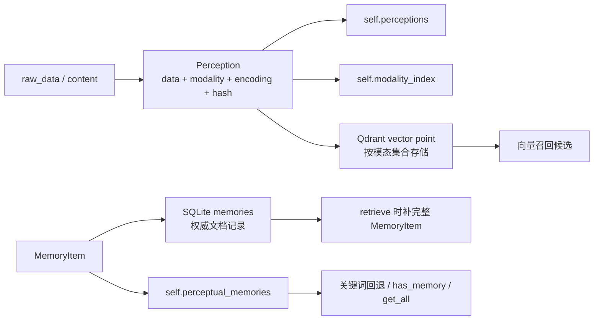

当前注释说 SQLite 是权威库，这个判断合理。但代码没有从 SQLite 回灌 `self.perceptual_memories`、`self.perceptions`、`self.modality_index`。所以重启后持久层有数据，本地查询接口仍可能空。

## 初始化流程

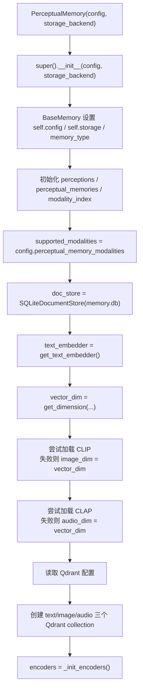

## 存储层交互

### SQLiteDocumentStore

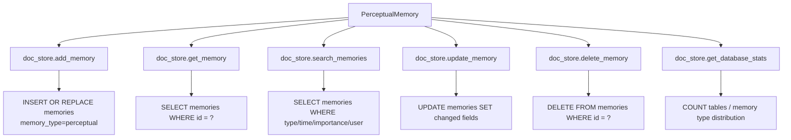

### QdrantVectorStore

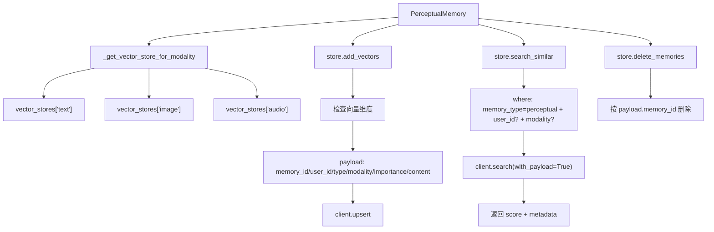

风险：初始化三个 collection 时都用 `vector_dim`，但 `_get_dim_for_modality('image')` 可能返回 CLIP 的 `projection_dim`，`audio` 可能返回 CLAP 的 `projection_dim`。如果这些维度不是 `vector_dim`，Qdrant 写入会维度不匹配。

## 方法交互路径

### add(memory_item)

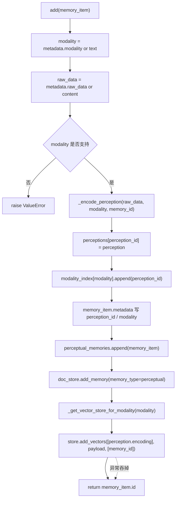

问题：内存缓存先写，SQLite 后写。SQLite 写失败时，内存已经脏。

### retrieve(query, limit, **kwargs)

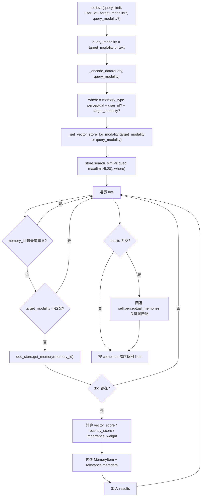

问题：回退只查内存缓存，不查 SQLite。重启后缓存为空，SQLite 有数据也不会进入回退结果。

### update(memory_id, content, importance, metadata)

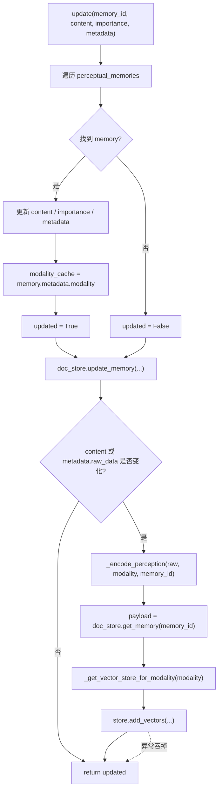

问题：`update()` 已经能选对应模态集合 upsert，这是对的。但如果 metadata 把记忆从一个模态改到另一个模态，旧模态集合里的旧向量不会删除，会留下重复索引。

### remove(memory_id)

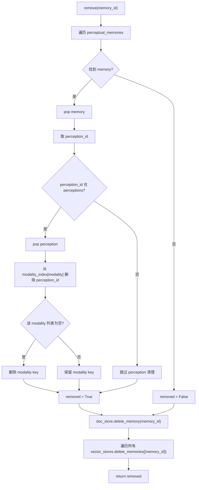

### forget(strategy, threshold, max_age_days)

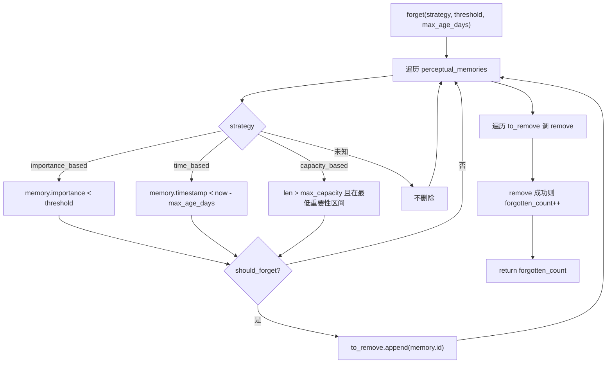

### clear()

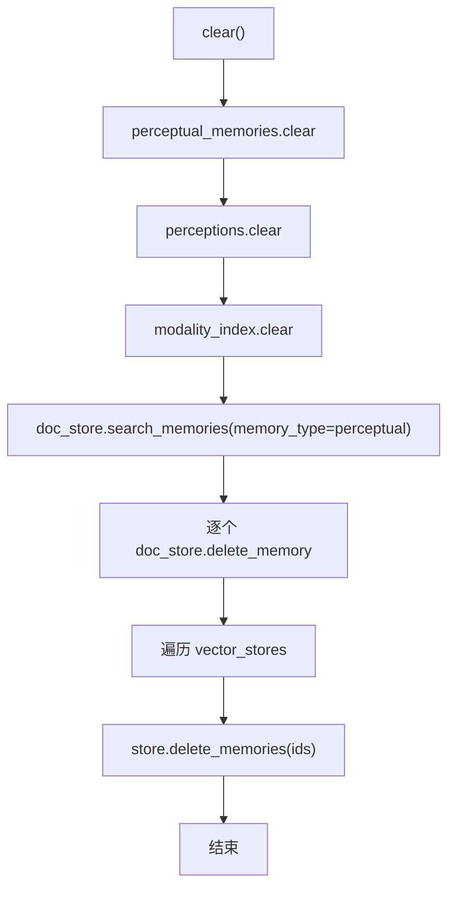

问题：先清本地缓存，再删 SQLite/Qdrant。后面失败时没有恢复路径。

### cross_modal_search(query, query_modality, target_modality, limit)

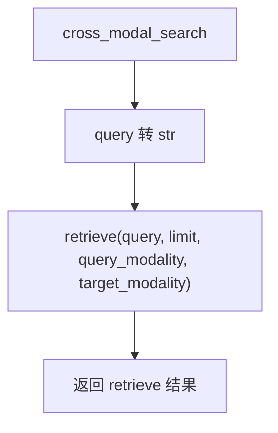

业务名字叫跨模态，但实现仍是调用 `retrieve()`。是否真跨模态取决于对应模态编码是否能进入同一可比较空间；现在 text/image/audio 是不同 collection，更多是“指定 query/target 模态检索”。

### get_by_modality(modality, limit)

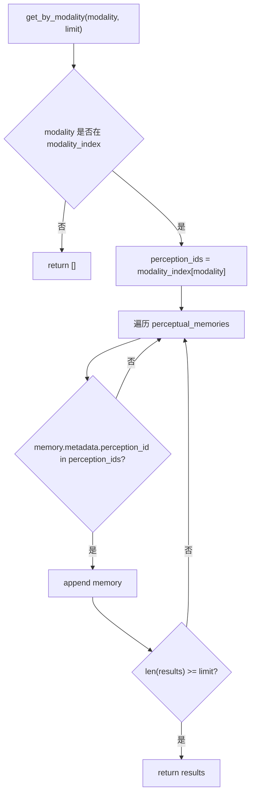

### generate_content(prompt, target_modality)

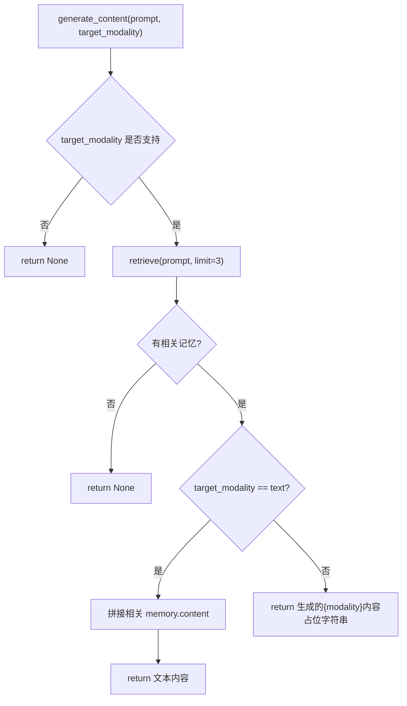

## 所有方法伪代码图与业务含义

### 方法业务含义总表

| 方法 | 业务操作 | 含义 | 存储交互 |
| --- | --- | --- | --- |
| `Perception.__init__` | 创建感知实体 | 把原始多模态数据和编码向量绑成运行期对象 | 无 |
| `Perception._calculate_hash` | 计算数据哈希 | 为原始数据生成稳定指纹 | 无 |
| `PerceptualMemory.__init__` | 初始化感知记忆 | 建缓存、SQLite、embedding、CLIP/CLAP、Qdrant 多集合、编码器 | SQLite / Qdrant 初始化 |
| `add` | 新增感知记忆 | 编码原始数据，写本地缓存、SQLite、Qdrant | SQLite add / Qdrant add |
| `retrieve` | 检索感知记忆 | 按模态编码 query，Qdrant 召回，SQLite 补详情，内存关键词回退 | Qdrant search / SQLite get |
| `update` | 更新感知记忆 | 改本地和 SQLite，尝试重编码并写 Qdrant | SQLite update；Qdrant 分支当前坏 |
| `remove` | 删除感知记忆 | 清本地感知对象、SQLite 记录和所有模态 Qdrant 向量 | SQLite delete / Qdrant delete |
| `has_memory` | 判断记忆存在 | 只查本地 `perceptual_memories` | 无 |
| `forget` | 遗忘策略 | 按重要性、时间或容量筛选后调用 `remove` | 间接 SQLite/Qdrant delete |
| `clear` | 清空感知记忆 | 清本地缓存、SQLite perceptual 记录、Qdrant 向量 | SQLite search/delete / Qdrant delete |
| `get_all` | 获取全部记忆 | 返回本地列表浅拷贝 | 无 |
| `get_stats` | 获取统计 | 汇总本地缓存、Qdrant 集合、SQLite 数据库统计 | Qdrant stats / SQLite stats |
| `cross_modal_search` | 跨模态搜索入口 | 参数转发到 `retrieve` | 间接 Qdrant/SQLite |
| `get_by_modality` | 按模态查询 | 根据本地 modality index 取记忆 | 无 |
| `generate_content` | 基于记忆生成内容 | 简单拼接文本或返回占位字符串 | 间接 retrieve |
| `_init_encoders` | 初始化编码器表 | 给每个支持模态选择 encoder | 无 |
| `_encode_perception` | 编码感知实体 | 原始数据转向量并包装成 `Perception` | 无 |
| `_encode_data` | 统一编码入口 | 按模态调用 encoder，并补齐/截断到目标维度 | 无 |
| `_text_encoder` | 文本编码 | 调用统一文本 embedding | embedding provider |
| `_image_encoder_hash` | 图像哈希编码 | CLIP 不可用时生成确定性向量 | 可能读本地图片文件 |
| `_image_encoder` | 图像编码 | 优先 CLIP，失败回退 hash | 可能读本地图片文件 |
| `_audio_encoder_hash` | 音频哈希编码 | CLAP 不可用时生成确定性向量 | 可能读本地音频文件 |
| `_audio_encoder` | 音频编码 | 优先 CLAP/librosa，失败回退 hash | 可能读本地音频文件 |
| `_default_encoder` | 默认编码 | 尝试文本编码，失败 hash | embedding provider 或无 |
| `_calculate_similarity` | 计算余弦相似度 | 本地编码相似度工具；当前主检索不用它 | 无 |
| `_hash_to_vector` | hash 转向量 | 用确定性随机数生成固定维向量 | 无 |
| `_no_grad.__enter__` | 关闭 torch 梯度 | 推理时省内存 | 无 |
| `_no_grad.__exit__` | 恢复 torch 梯度 | 清理推理上下文 | 无 |
| `_get_vector_store_for_modality` | 选择 Qdrant store | 根据模态选 text/image/audio 集合，默认 text | 无 |
| `_get_dim_for_modality` | 选择向量维度 | image/audio 用模型维度，否则 text 维度 | 无 |

### 数据对象伪代码图

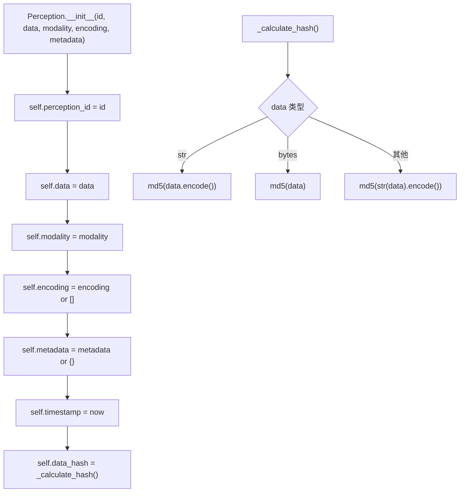

业务含义：`Perception` 是原始数据视图，保存 raw data、模态、向量编码和 hash。它不是持久对象，重启后不会自动恢复。

### 初始化伪代码图

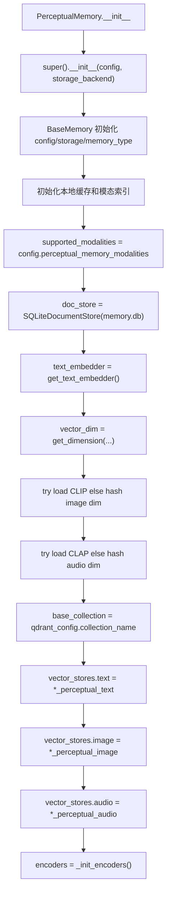

业务含义：初始化的业务目标是把多模态输入统一到“每种模态一个编码器、一个 Qdrant 集合”的结构。现在继承链已经接上，真正要盯的是各模态编码维度和 Qdrant collection 维度是否一致。

### 写入与检索伪代码图

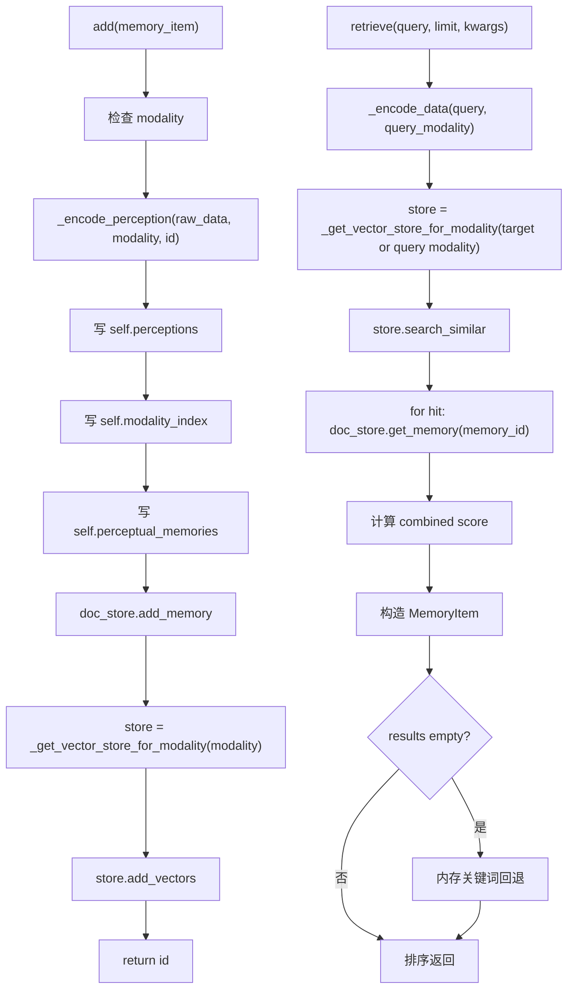

业务含义：写入把多模态数据变成可搜索向量，检索用同模态或指定模态集合召回，再从 SQLite 补内容。这套逻辑依赖“编码维度一致”和“Qdrant 集合选择正确”。

### 更新删除与生命周期伪代码图

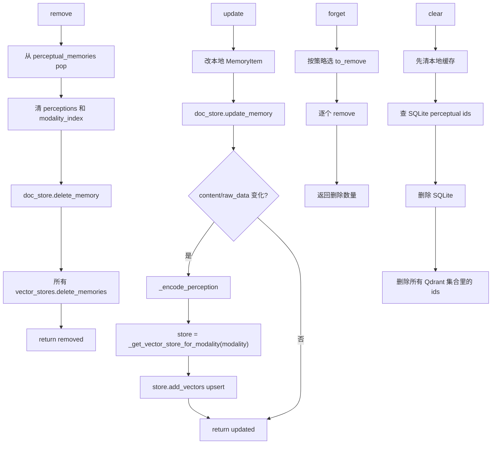

业务含义：生命周期操作想做硬删除。`update()` 现在能写回当前模态集合，但如果发生模态切换，需要额外删除旧模态集合里的向量；`remove()` 比较稳，因为它遍历所有模态集合删除向量。

### 编码器伪代码图

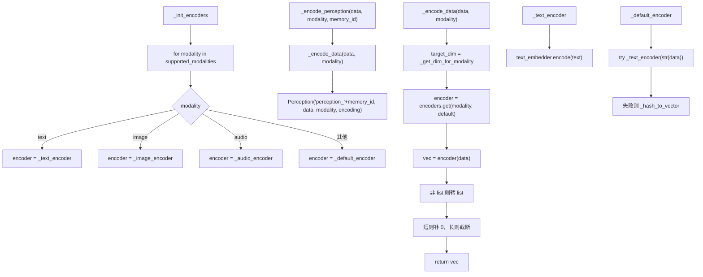

业务含义：编码器层的价值是把多模态输入压成固定维向量。实现是务实的：有 CLIP/CLAP 就用，没有就 hash。但维度必须和 Qdrant collection 一致，否则索引写不进去。

### 图像音频编码伪代码图

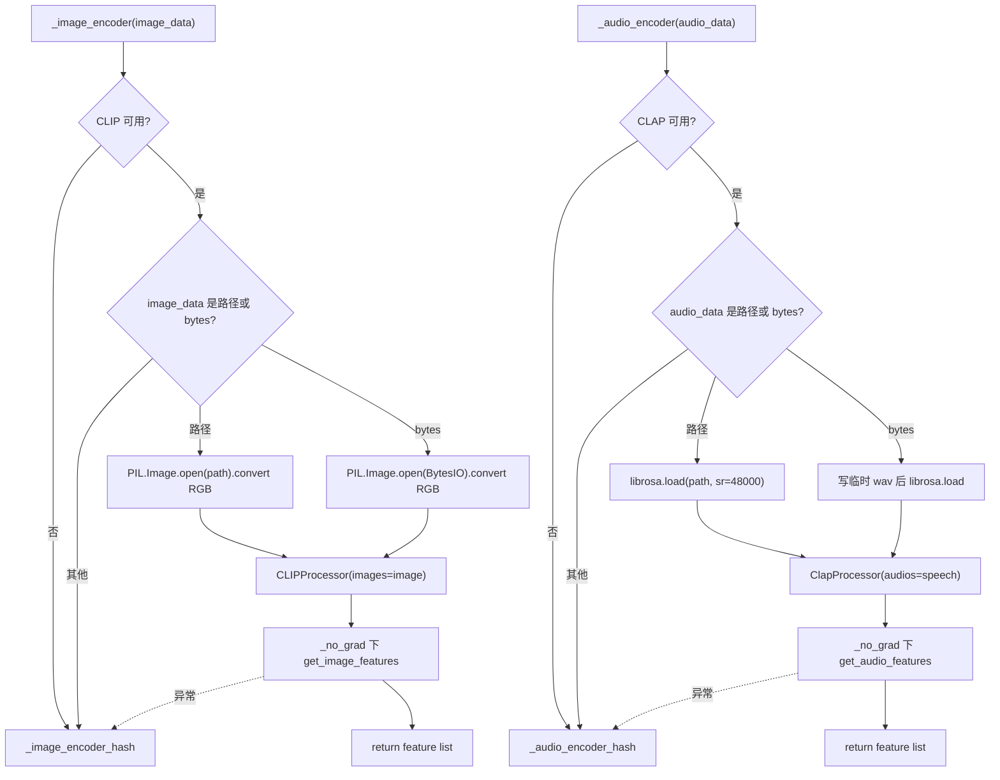

业务含义：图像和音频编码是真实多模态能力的核心，但依赖重、失败路径多。hash 回退能保证流程跑通，但语义质量不要自欺欺人。

### 查询、生成与工具方法伪代码图

```mermaid
flowchart TD
    A["has_memory(id)"] --> B["any memory.id == id in perceptual_memories"]
    C["get_all()"] --> D["return perceptual_memories.copy()"]
    E["get_stats()"] --> F["统计本地 count/modality_counts"]
    F --> G["遍历 vector_stores.get_collection_stats"]
    G --> H["doc_store.get_database_stats"]
    H --> I["return stats"]

    J["cross_modal_search"] --> K["return retrieve(str(query), query_modality, target_modality)"]
    L["get_by_modality"] --> M["从 modality_index 取 perception_ids"]
    M --> N["扫描 perceptual_memories 命中 perception_id"]
    N --> O["return top limit"]

    P["generate_content"] --> Q{"target_modality supported?"}
    Q -->|否| R["return None"]
    Q -->|是| S["retrieve(prompt, limit=3)"]
    S --> T{"有结果?"}
    T -->|否| U["return None"]
    T -->|是| V{"target text?"}
    V -->|是| W["拼接 memory.content"]
    V -->|否| X["return 占位生成字符串"]

    Y["_calculate_similarity"] --> Z["余弦相似度"]
    AA["_hash_to_vector"] --> AB["sha256 seed -> random vector"]
    AC["_no_grad"] --> AD["关闭并恢复 torch grad"]
    AE["_get_vector_store_for_modality"] --> AF["返回对应 Qdrant store，默认 text"]
    AG["_get_dim_for_modality"] --> AH["image/audio/text 维度选择"]
```

业务含义：这些方法是读侧和辅助层。多数只看本地缓存，不看 SQLite。`generate_content()` 不是生成模型，只是基于检索结果拼字符串。

## 与 MemoryManager 的入口关系

```mermaid
flowchart TD
    MM["MemoryManager"] --> Init["enable_perceptual=True"]
    Init --> PM["PerceptualMemory(config)"]
    Add["MemoryManager.add_memory"] --> Classify["_classify_memory_type"]
    Classify -->|"perceptual"| PMAdd["PerceptualMemory.add"]
    Retrieve["MemoryManager.retrieve_memories"] --> PMRetrieve["PerceptualMemory.retrieve"]
    Update["MemoryManager.update_memory"] --> Has["PerceptualMemory.has_memory"]
    Has -->|"true"| PMUpdate["PerceptualMemory.update"]
    Remove["MemoryManager.remove_memory"] --> Has2["PerceptualMemory.has_memory"]
    Has2 -->|"true"| PMRemove["PerceptualMemory.remove"]
    Forget["MemoryManager.forget_memories"] --> PMForget["PerceptualMemory.forget"]
    Stats["MemoryManager.get_memory_stats"] --> PMStats["PerceptualMemory.get_stats"]
```

## 完整主流程总图

```mermaid
flowchart TB
    subgraph Entry["入口"]
        Add["add"]
        Retrieve["retrieve / cross_modal_search"]
        Update["update"]
        Remove["remove / forget"]
        Clear["clear"]
        Read["get_all / get_stats / get_by_modality / generate_content"]
    end

    subgraph Cache["本地缓存"]
        Perceptions["self.perceptions"]
        Memories["self.perceptual_memories"]
        ModalityIndex["self.modality_index"]
    end

    subgraph Encode["编码层"]
        Text["text_embedder"]
        CLIP["CLIP or image hash"]
        CLAP["CLAP or audio hash"]
        Default["default encoder"]
    end

    subgraph Storage["存储层"]
        SQLite["SQLiteDocumentStore"]
        QText["Qdrant text collection"]
        QImage["Qdrant image collection"]
        QAudio["Qdrant audio collection"]
    end

    Add --> Encode
    Add --> Cache
    Add --> SQLite
    Add --> QText
    Add --> QImage
    Add --> QAudio

    Retrieve --> Encode
    Retrieve --> QText
    Retrieve --> QImage
    Retrieve --> QAudio
    Retrieve --> SQLite
    Retrieve --> Cache

    Update --> Cache
    Update --> SQLite
    Update --> QText
    Update --> QImage
    Update --> QAudio

    Remove --> Cache
    Remove --> SQLite
    Remove --> QText
    Remove --> QImage
    Remove --> QAudio

    Clear --> Cache
    Clear --> SQLite
    Clear --> QText
    Clear --> QImage
    Clear --> QAudio

    Read --> Cache
    Read --> SQLite
    Read --> QText
    Read --> QImage
    Read --> QAudio
```

## 品味评分

黄色偏红。比旧状态好，至少继承链和 `update()` 的 Qdrant store 选择已经修正；但状态一致性仍然脆。

多模态编码、SQLite 权威库、Qdrant 分模态索引，这些方向都可以。现在主流程大体能说通，但还没有做到“权威库、缓存、索引”三者的严格一致，异常也经常被吞。工程上还没到好品味。

## 致命问题

- Qdrant collection 初始化全部使用 `self.vector_dim`，但 `_get_dim_for_modality("image"/"audio")` 可能返回 CLIP/CLAP 维度，导致向量维度不匹配。
- `update()` 在模态切换时只 upsert 新模态集合，不删除旧模态集合里的旧向量，检索可能重复或命中旧索引。
- `clear()` 先清本地缓存再删 SQLite/Qdrant，后续失败会让本地和持久层分裂。
- `has_memory()`、`get_all()`、`get_by_modality()` 只查内存缓存，重启后持久层数据不可见。
- `cross_modal_search()` 名字过大，当前实现只是转发到 `retrieve()`，并不真正建立统一跨模态向量空间。

## 改进方向

1. 每个模态集合必须用对应维度创建，或者所有编码器强制输出统一 `vector_dim`。二选一，别混。
2. `update()` 遇到模态切换时，要从旧模态集合删除旧向量，再写新模态集合。
3. 生命周期顺序统一成“先权威库，后本地缓存，最后向量索引”，失败路径要可观察。
4. 初始化时从 SQLite 回灌本地缓存，或者别让读接口只依赖内存。
5. 真要跨模态，就把 text/image/audio 放进同一语义空间；否则函数名改诚实点。
