# SemanticMemory 交互流程分析

基于现有信息，我理解需求是：分析 `SemanticMemory` 的真实交互流程，包括 `self` 上各组件之间如何协作、它与 Qdrant/Neo4j 等存储层如何交互、每个方法的调用路径是什么，并用 Mermaid 流程图落到同目录文档里。

## 核心判断

值得分析。`SemanticMemory` 不是单纯的语义记忆列表，它实际是三套东西绑在一起：本地缓存、Qdrant 向量索引、Neo4j 实体关系图。问题也在这里：写入路径看起来很强，更新和删除路径却没有完整回写存储层。

关键洞察：

- 数据结构：`MemoryItem` 是对外记忆协议；`Entity`/`Relation` 是知识图谱缓存对象；Qdrant 存记忆向量和 payload；Neo4j 存实体、词元、概念、关系。
- 复杂度：检索是“双路召回 + 混合排序”，向量召回来自 Qdrant，图召回来自 Neo4j，但图召回最后仍依赖 `self.semantic_memories` 补完整记忆内容。
- 风险点：`update()` 基本只改本地缓存，不更新 Qdrant/Neo4j；`remove()` 删除 Qdrant，但 `_cleanup_entities_and_relations()` 是空实现，Neo4j 图不会清；没有持久化记忆正文的权威文档库。

## 组件关系

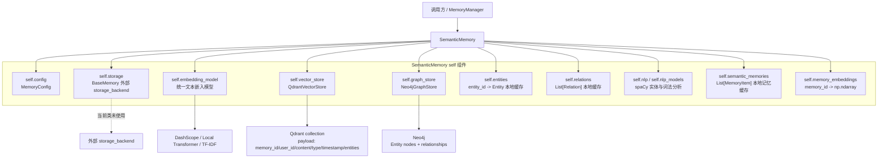

`self.storage` 来自 `BaseMemory`，但当前 `SemanticMemory` 没有任何方法调用它。别把它当主存储，真正参与流程的是 `self.vector_store` 和 `self.graph_store`，而记忆正文的完整对象只在 `self.semantic_memories`。

## 数据所有权

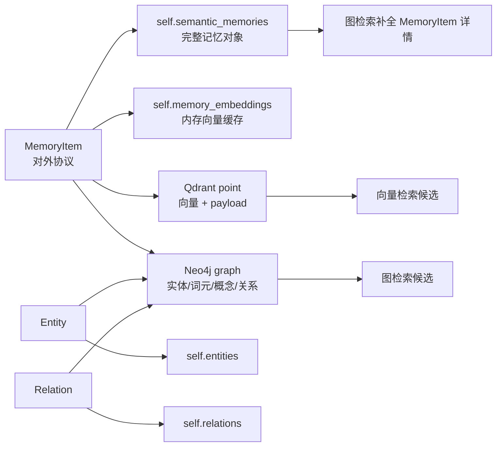

坏味道：没有 SQLite 这类权威文档库。Qdrant payload 有 `content`，Neo4j 实体属性里有 `memory_id`，但完整 `MemoryItem` 只在内存列表里。进程重启后，图和向量可能还在，`self.semantic_memories` 没了，图检索就补不出记忆详情。

## 初始化流程

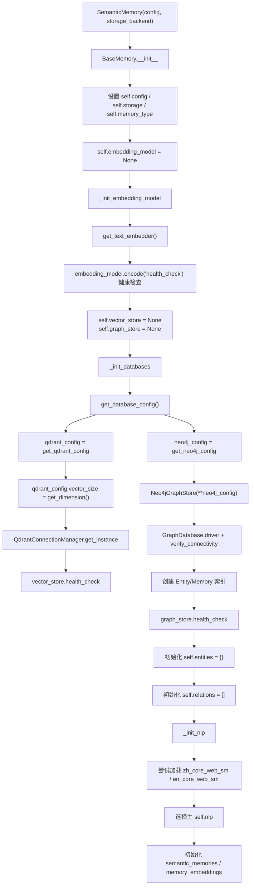

## 存储层交互

### Qdrant 向量层

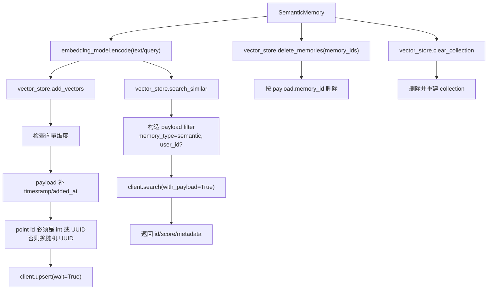

### Neo4j 图层

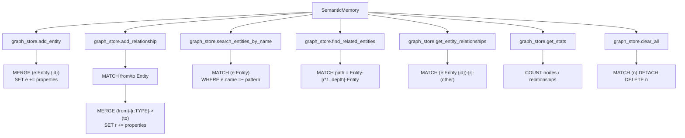

注意：`Neo4jGraphStore` 创建了 `Memory` 节点索引，但 `SemanticMemory.add()` 并没有创建 `Memory` 节点。它只创建 `Entity` 节点和实体间关系，把 `memory_id` 作为属性塞进去。

## 方法交互路径

### add(memory_item)

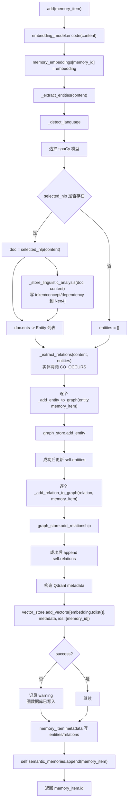

风险：

- Neo4j 和 Qdrant 没有事务。前面写图成功，后面写向量失败，系统进入部分成功状态。
- `memory_embeddings` 先写，后续任何异常都会导致内存向量缓存可能比 `semantic_memories` 多一条。
- 图层没有 `Memory` 节点，只有实体/关系上的 `memory_id` 属性。

### retrieve(query, limit, **kwargs)

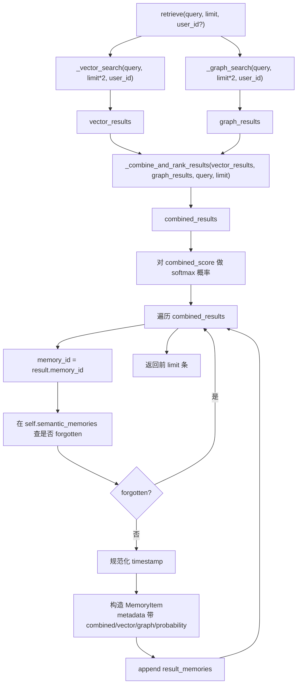

### _vector_search(query, limit, user_id)

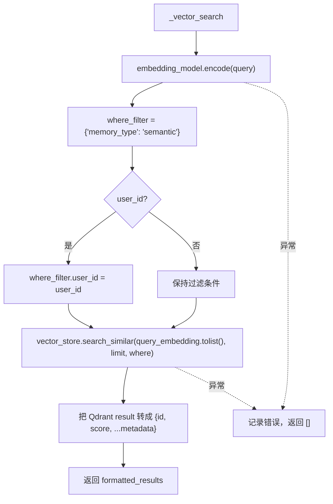

### _graph_search(query, limit, user_id)

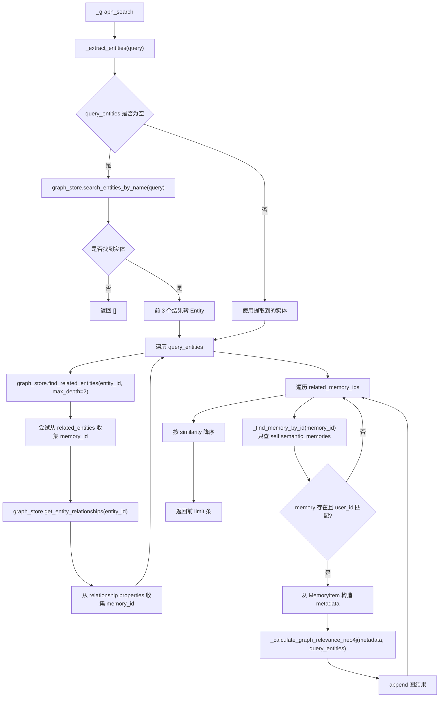

最大问题在 `O`：图数据库只提供候选 ID，完整记忆必须从本地缓存找。进程重启后，Neo4j 里有图，`self.semantic_memories` 为空，图检索还是返回不了记忆。

### _combine_and_rank_results(vector_results, graph_results, query, limit)

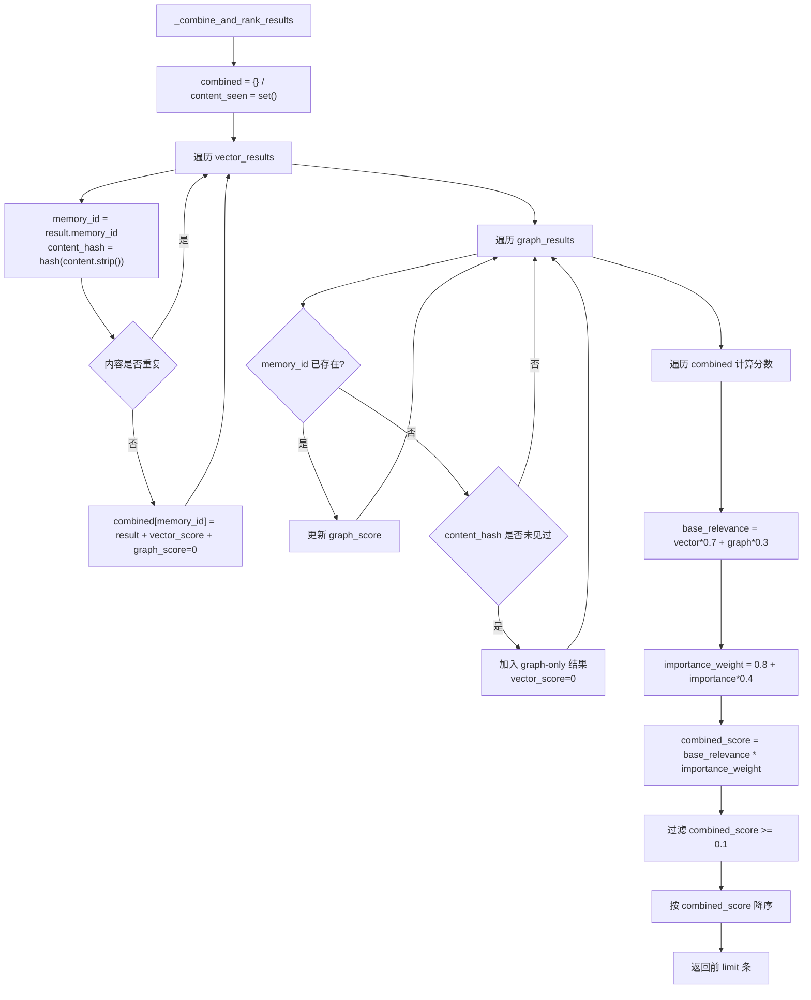

这里 `query` 参数没有实际使用。不是致命问题，但接口假装需要它，代码却不用它，这是脏接口。

### _extract_entities(text)

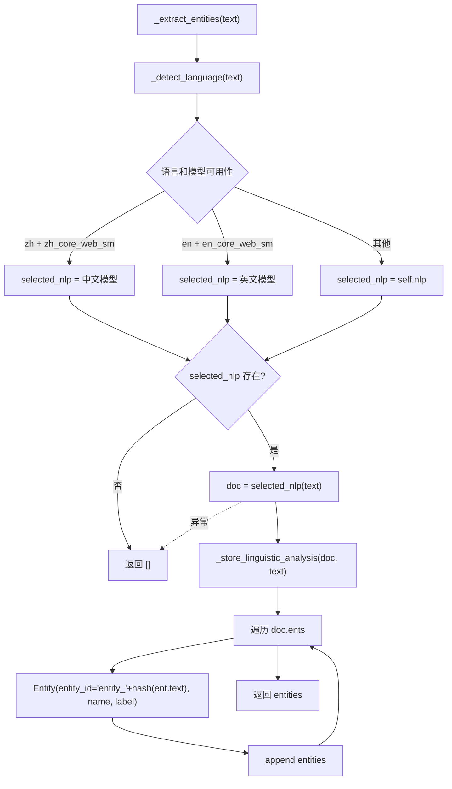

### _store_linguistic_analysis(doc, text)

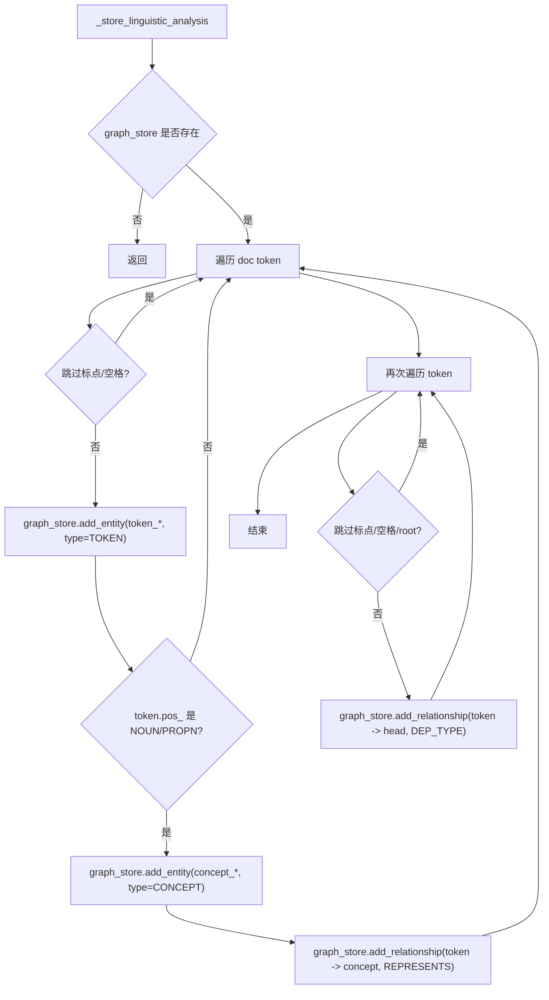

风险：这一步在实体提取期间就写 Neo4j。也就是说，`add()` 还没决定是否成功，词法分析副作用已经落库。

### _extract_relations(text, entities)

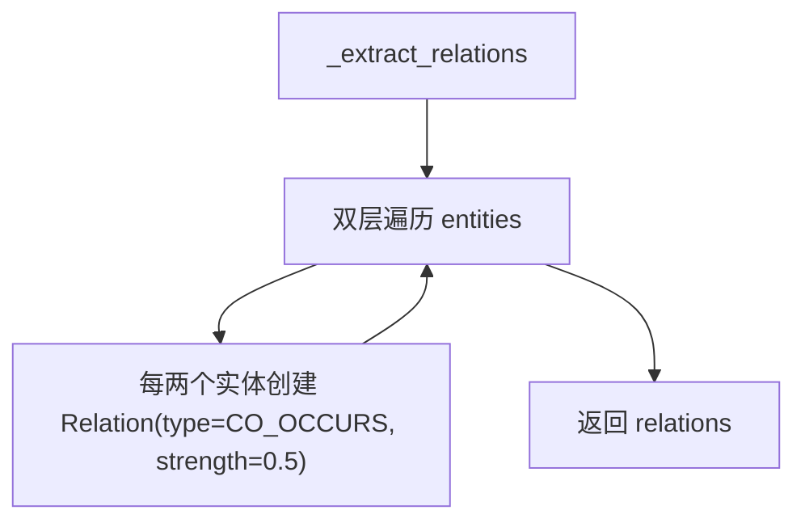

### _add_entity_to_graph(entity, memory_item)

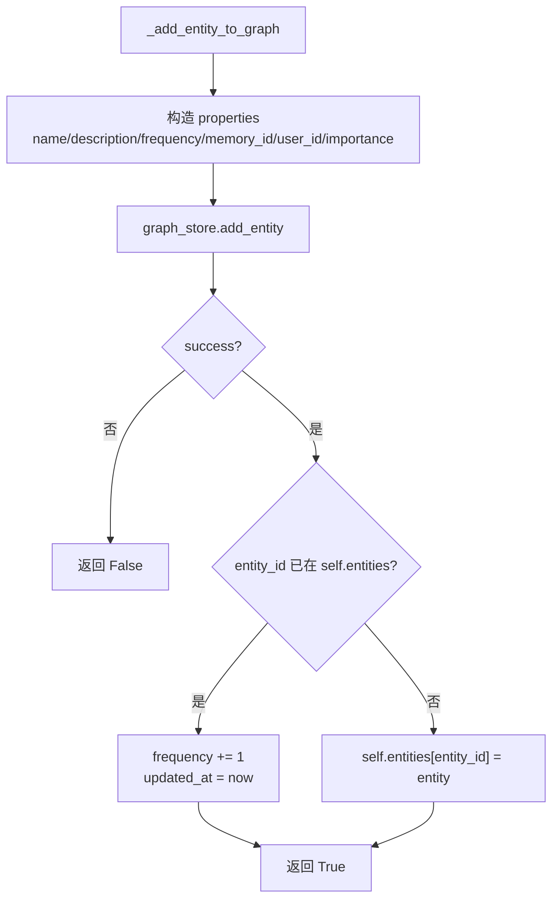

### _add_relation_to_graph(relation, memory_item)

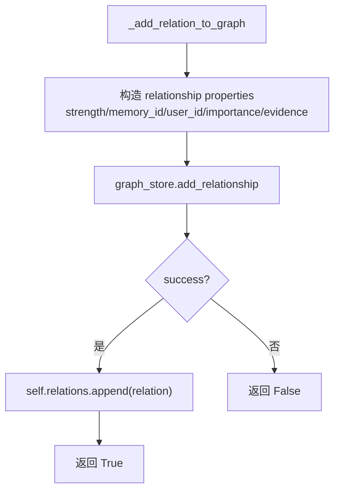

### update(memory_id, content, importance, metadata)

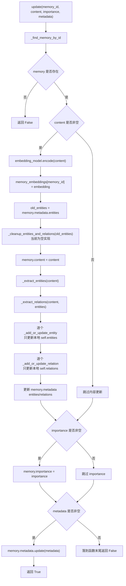

致命问题：

- 内容更新没有调用 `vector_store.add_vectors()`，Qdrant 仍是旧向量/旧 payload。
- 内容更新没有调用 `graph_store.add_entity/add_relationship()`，Neo4j 不会写入新实体关系。它只更新本地缓存。
- 如果只更新 `content` 或 `importance`，但 `metadata is None`，函数最后返回 `False`，即使内存已经改了。

### remove(memory_id)

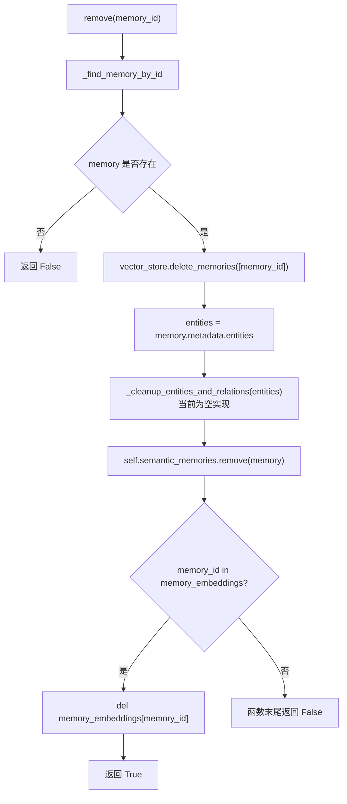

风险：

- Neo4j 实体和关系不会删除。
- 如果记忆在 `semantic_memories` 里，但 `memory_embeddings` 缺失，实际已经删除了记忆，返回值却是 `False`。

### forget(strategy, threshold, max_age_days)

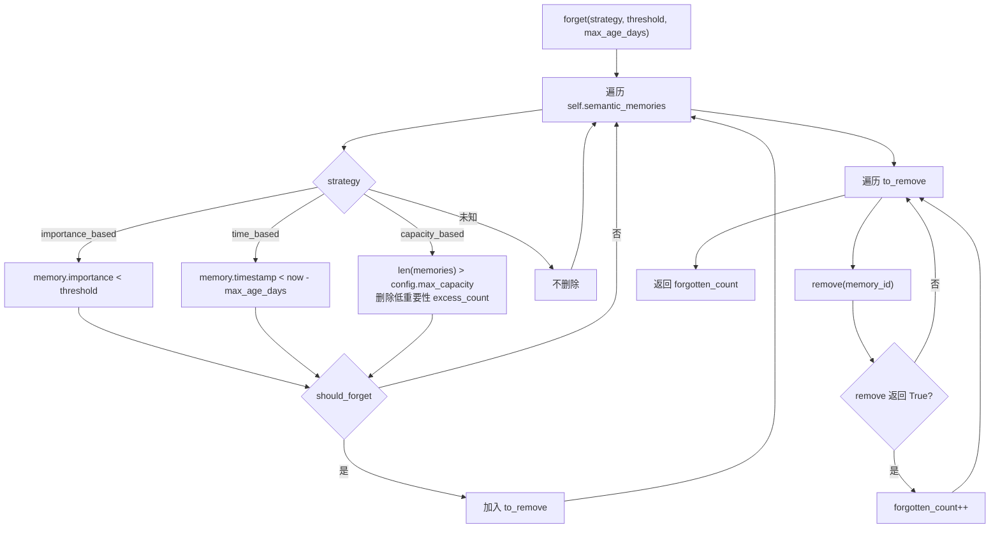

### clear()

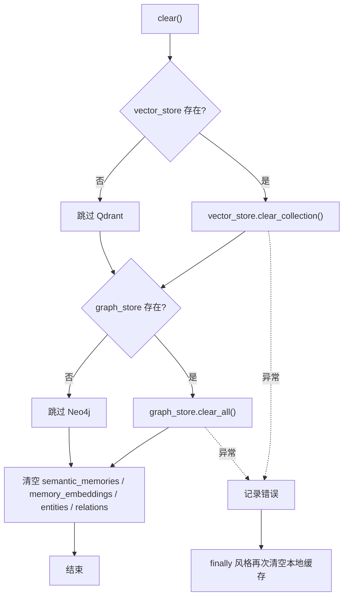

注意：`clear()` 会清空整个 Qdrant collection 和整个 Neo4j 数据库，不只清 semantic 类型。这可能破坏其他记忆类型或其他模块的数据。

### has_memory(memory_id)

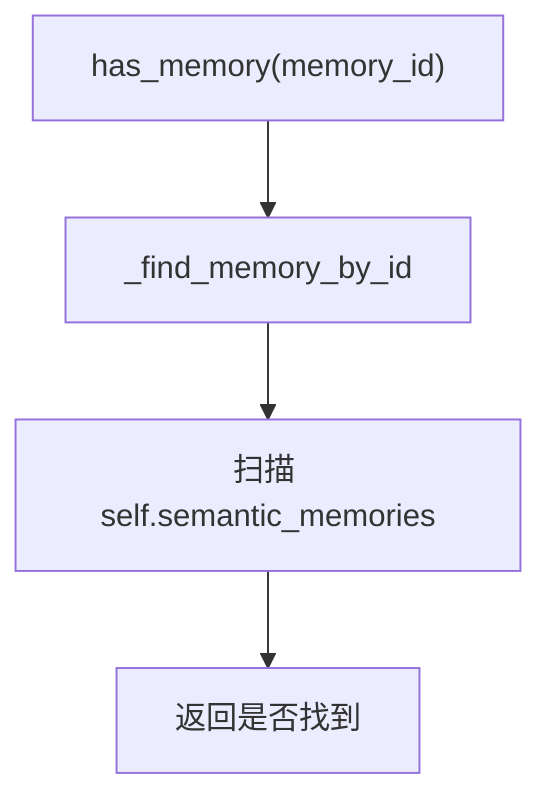

它不查 Qdrant，也不查 Neo4j。持久层有数据但本地缓存空时，它会返回 `False`。

### get_all()

```mermaid
flowchart TD
    A["get_all()"] --> B["self.semantic_memories.copy()"]
    B --> C["返回 MemoryItem 列表浅拷贝"]
```

### get_stats()

```mermaid
flowchart TD
    A["get_stats()"] --> B["graph_store.get_stats()"]
    B -.异常.-> C["graph_stats = {}"]
    B --> D["active_memories = self.semantic_memories"]
    C --> D
    D --> E["统计本地 count/entities_count/relations_count/avg_importance"]
    E --> F["合并 graph_nodes/graph_edges"]
    F --> G["返回 memory_type=enhanced_semantic"]
```

这里没有读 Qdrant 统计，只有 Neo4j 统计和本地缓存统计。

### get_entity(entity_id)

```mermaid
flowchart TD
    A["get_entity(entity_id)"] --> B["self.entities.get(entity_id)"]
    B --> C["返回 Entity 或 None"]
```

### search_entities(query, limit)

```mermaid
flowchart TD
    A["search_entities(query, limit)"] --> B["query_lower = query.lower()"]
    B --> C["遍历 self.entities.values()"]
    C --> D["名称匹配 +2"]
    D --> E["类型匹配 +1"]
    E --> F["描述匹配 +0.5"]
    F --> G["score *= log(1 + frequency)"]
    G --> H{"score > 0"}
    H -->|是| I["加入 scored_entities"]
    H -->|否| C
    I --> C
    C --> J["按 score 降序"]
    J --> K["返回前 limit 个 Entity"]
```

只搜本地缓存，不搜 Neo4j。

### get_related_entities(entity_id, relation_types, max_hops)

```mermaid
flowchart TD
    A["get_related_entities"] --> B{"graph_store 是否存在"}
    B -->|否| C["返回 []"]
    B -->|是| D["graph_store.find_related_entities(entity_id, relation_types, max_hops)"]
    D --> E["遍历 entity_data"]
    E --> F["尝试 self.entities.get(entity_data.id)"]
    F --> G{"本地缓存命中?"}
    G -->|否| H["创建临时 Entity"]
    G -->|是| I["使用缓存 Entity"]
    H --> J["append related 项"]
    I --> K["当前实现没有 append 缓存命中项"]
    J --> E
    E --> L["按 distance/strength 排序"]
    L --> M["返回 related"]
```

这里有明显 bug：只有本地缓存没命中时才 append；缓存命中时反而不会加入结果。

### export_knowledge_graph()

```mermaid
flowchart TD
    A["export_knowledge_graph()"] --> B{"graph_store 存在?"}
    B -->|是| C["graph_store.get_stats()"]
    B -->|否| D["stats = {}"]
    C --> E["导出 self.entities.to_dict()"]
    D --> E
    E --> F["导出 self.relations.to_dict()"]
    F --> G["附 graph_stats + cached counts"]
    G --> H["返回 dict"]
    C -.异常.-> I["返回空 entities/relations + error"]
```

## 与 MemoryManager 的入口关系

```mermaid
flowchart TD
    MM["MemoryManager"] --> Init["enable_semantic=True"]
    Init --> SM["SemanticMemory(config)"]

    AddMemory["MemoryManager.add_memory"] --> Classify["_classify_memory_type"]
    Classify -->|"semantic"| MakeItem["构造 MemoryItem"]
    MakeItem --> SMAdd["SemanticMemory.add"]

    Retrieve["MemoryManager.retrieve_memories"] --> SMRetrieve["SemanticMemory.retrieve"]
    Update["MemoryManager.update_memory"] --> Has["SemanticMemory.has_memory"]
    Has -->|"true"| SMUpdate["SemanticMemory.update"]
    Remove["MemoryManager.remove_memory"] --> Has2["SemanticMemory.has_memory"]
    Has2 -->|"true"| SMRemove["SemanticMemory.remove"]
    Forget["MemoryManager.forget_memories"] --> SMForget["SemanticMemory.forget"]
    Stats["MemoryManager.get_memory_stats"] --> SMStats["SemanticMemory.get_stats"]
    Consolidate["MemoryManager.consolidate_memories"] --> GetAll["SemanticMemory.get_all 或 add"]
```

`MemoryManager` 的更新和删除依赖 `has_memory()` 找记忆类型，而 `has_memory()` 只看 `self.semantic_memories`。所以重启后，即使 Qdrant/Neo4j 里还有数据，Manager 也找不到这条语义记忆。

## 完整主流程总图

```mermaid
flowchart TB
    subgraph Entry["入口方法"]
        Add["add"]
        Retrieve["retrieve"]
        Update["update"]
        Remove["remove"]
        Forget["forget"]
        Clear["clear"]
        Read["get_all / get_stats / entity APIs / export"]
    end

    subgraph Local["本地缓存"]
        Memories["self.semantic_memories"]
        Embeddings["self.memory_embeddings"]
        Entities["self.entities"]
        Relations["self.relations"]
    end

    subgraph NLP["NLP 层"]
        Detect["language detection"]
        Spacy["spaCy models"]
        EntityExtract["Entity extraction"]
        RelationExtract["CO_OCCURS relation extraction"]
        Linguistic["token/concept/dependency analysis"]
    end

    subgraph Storage["存储层"]
        Embedder["embedding_model"]
        Qdrant["Qdrant vector store"]
        Neo4j["Neo4j graph store"]
        StorageBackend["self.storage<br/>当前未使用"]
    end

    Add --> Embedder
    Add --> EntityExtract
    EntityExtract --> Detect
    EntityExtract --> Spacy
    EntityExtract --> Linguistic
    Linguistic --> Neo4j
    EntityExtract --> RelationExtract
    Add --> Neo4j
    Add --> Qdrant
    Add --> Memories
    Add --> Embeddings
    Add --> Entities
    Add --> Relations

    Retrieve --> Embedder
    Retrieve --> Qdrant
    Retrieve --> EntityExtract
    Retrieve --> Neo4j
    Retrieve --> Memories

    Update --> Memories
    Update --> Embeddings
    Update --> EntityExtract
    Update --> RelationExtract
    Update --> Entities
    Update --> Relations

    Remove --> Qdrant
    Remove --> Memories
    Remove --> Embeddings

    Forget --> Remove

    Clear --> Qdrant
    Clear --> Neo4j
    Clear --> Memories
    Clear --> Embeddings
    Clear --> Entities
    Clear --> Relations

    Read --> Memories
    Read --> Entities
    Read --> Relations
    Read --> Neo4j

    StorageBackend -.无主流程调用.-> Add
```

## 所有方法伪代码图与业务含义

### 方法业务含义总表

| 方法 | 业务操作 | 含义 | 存储交互 |
| --- | --- | --- | --- |
| `Entity.__init__` | 创建实体对象 | 把文本里的概念、人名、组织、词元等抽象成图节点候选 | 无 |
| `Entity.to_dict` | 实体序列化 | 导出知识图谱时把实体对象变成普通字典 | 无 |
| `Relation.__init__` | 创建关系对象 | 表示实体间共现、依存、代表等边候选 | 无 |
| `Relation.to_dict` | 关系序列化 | 导出知识图谱时把关系对象变成普通字典 | 无 |
| `SemanticMemory.__init__` | 初始化语义记忆系统 | 建好 embedding、Qdrant、Neo4j、spaCy、本地缓存 | Qdrant / Neo4j 连接和健康检查 |
| `_init_embedding_model` | 初始化嵌入模型 | 获得统一文本向量生成器 | 可能调用外部 embedding provider |
| `_init_databases` | 初始化数据库 | 连接 Qdrant 和 Neo4j，并做健康检查 | Qdrant / Neo4j |
| `_init_nlp` | 初始化 NLP 模型 | 加载中文/英文 spaCy，用于实体和词法分析 | 无 |
| `add` | 新增语义记忆 | 把一条记忆拆成向量、实体、关系、本地对象 | Qdrant upsert / Neo4j merge |
| `retrieve` | 检索语义记忆 | 向量召回和图召回合并，返回 `MemoryItem` | Qdrant search / Neo4j search |
| `_vector_search` | 向量召回 | 用 query embedding 搜 Qdrant | Qdrant search |
| `_graph_search` | 图召回 | 从 query 实体出发查 Neo4j 相关记忆 ID，再用本地缓存补详情 | Neo4j read + 本地缓存 |
| `_combine_and_rank_results` | 混合排序 | 合并向量结果和图结果，计算综合分 | 无 |
| `_detect_language` | 粗略语言检测 | 决定用中文还是英文 spaCy 模型 | 无 |
| `_extract_entities` | 实体提取 | 从文本抽出实体，同时触发词法分析落图 | Neo4j side effect |
| `_store_linguistic_analysis` | 词法分析入图 | 把 token、concept、dependency 写进 Neo4j | Neo4j write |
| `_extract_relations` | 关系提取 | 对实体两两建立 `CO_OCCURS` 关系候选 | 无 |
| `_add_entity_to_graph` | 实体入图 | 写 Neo4j Entity 节点，并更新本地实体缓存 | Neo4j write |
| `_add_relation_to_graph` | 关系入图 | 写 Neo4j 实体关系，并更新本地关系缓存 | Neo4j write |
| `_calculate_graph_relevance_neo4j` | 图相关性评分 | 按实体匹配、实体密度、关系密度算分 | 无 |
| `_add_or_update_entity` | 本地实体缓存更新 | 更新或增加 `self.entities`，不写 Neo4j | 无 |
| `_add_or_update_relation` | 本地关系缓存更新 | 更新或增加 `self.relations`，不写 Neo4j | 无 |
| `_find_memory_by_id` | 本地记忆查找 | 在 `self.semantic_memories` 里线性查找 | 无 |
| `update` | 更新语义记忆 | 当前只更新本地缓存和 embedding 缓存，没回写 Qdrant/Neo4j | 无有效持久化回写 |
| `remove` | 删除语义记忆 | 删除 Qdrant 向量和本地缓存，Neo4j 清理为空实现 | Qdrant delete |
| `_cleanup_entities_and_relations` | 清理实体关系 | 预留清理逻辑，目前什么也不做 | 无 |
| `has_memory` | 判断记忆存在 | 只查本地 `self.semantic_memories` | 无 |
| `forget` | 按策略遗忘 | 找出低重要性、过期或超容量记忆，然后调用 `remove` | 间接 Qdrant delete |
| `clear` | 清空语义记忆 | 清空 Qdrant collection、Neo4j 全库和本地缓存 | Qdrant clear / Neo4j clear |
| `get_all` | 获取全部语义记忆 | 返回本地记忆列表浅拷贝 | 无 |
| `get_stats` | 统计语义记忆 | 合并本地缓存统计和 Neo4j 图统计 | Neo4j stats |
| `get_entity` | 获取单个实体 | 从本地实体缓存按 ID 取实体 | 无 |
| `search_entities` | 搜索实体 | 在本地实体缓存按名称、类型、描述打分 | 无 |
| `get_related_entities` | 获取相关实体 | 从 Neo4j 查关联实体，再尝试用本地缓存包装 | Neo4j read |
| `export_knowledge_graph` | 导出知识图谱 | 导出本地缓存实体/关系和 Neo4j 统计 | Neo4j stats |

### 数据对象伪代码图

```mermaid
flowchart TD
    A["Entity.__init__(id, name, type, desc, props)"] --> B["self.entity_id = id"]
    B --> C["self.name = name"]
    C --> D["self.entity_type = type or MISC"]
    D --> E["self.properties = props or {}"]
    E --> F["created_at / updated_at = now"]
    F --> G["frequency = 1"]
    G --> H["Entity.to_dict()"]
    H --> I["返回 entity_id/name/type/description/properties/frequency"]

    J["Relation.__init__(from, to, type, strength, evidence, props)"] --> K["self.from_entity = from"]
    K --> L["self.to_entity = to"]
    L --> M["self.relation_type = type"]
    M --> N["self.strength = strength"]
    N --> O["self.evidence = evidence"]
    O --> P["created_at = now; frequency = 1"]
    P --> Q["Relation.to_dict()"]
    Q --> R["返回 from/to/type/strength/evidence/properties/frequency"]
```

业务含义：`Entity` 和 `Relation` 不是持久层对象，只是图写入前后的本地业务对象。真正落库靠 `_add_entity_to_graph()` 和 `_add_relation_to_graph()`。

### 初始化方法伪代码图

```mermaid
flowchart TD
    A["SemanticMemory.__init__"] --> B["BaseMemory.__init__(config, storage_backend)"]
    B --> C["_init_embedding_model()"]
    C --> D["embedding_model = get_text_embedder()"]
    D --> E["try encode('health_check')"]
    E --> F["_init_databases()"]
    F --> G["db_config = get_database_config()"]
    G --> H["vector_store = QdrantConnectionManager.get_instance(qdrant_config)"]
    H --> I["graph_store = Neo4jGraphStore(neo4j_config)"]
    I --> J["vector_store.health_check()"]
    J --> K["graph_store.health_check()"]
    K --> L["entities = {}; relations = []"]
    L --> M["_init_nlp()"]
    M --> N["try load zh_core_web_sm"]
    N --> O["try load en_core_web_sm"]
    O --> P["选择 self.nlp，失败则 None"]
    P --> Q["semantic_memories = []"]
    Q --> R["memory_embeddings = {}"]
```

业务含义：初始化阶段把“语义记忆”的三种能力装起来：向量能力负责相似度，图能力负责实体关系，NLP 能力负责从文本里抽结构。问题是没有从持久层回灌本地缓存。

### 写入方法伪代码图

```mermaid
flowchart TD
    A["add(memory_item)"] --> B["embedding = embedding_model.encode(content)"]
    B --> C["memory_embeddings[id] = embedding"]
    C --> D["entities = _extract_entities(content)"]
    D --> E["relations = _extract_relations(content, entities)"]
    E --> F["for entity in entities"]
    F --> G["_add_entity_to_graph(entity, memory_item)"]
    G --> H["graph_store.add_entity(...)"]
    H --> I["成功则更新 self.entities"]
    I --> J["for relation in relations"]
    J --> K["_add_relation_to_graph(relation, memory_item)"]
    K --> L["graph_store.add_relationship(...)"]
    L --> M["成功则 append self.relations"]
    M --> N["metadata = memory_id/user_id/content/type/timestamp/importance/entities/counts"]
    N --> O["vector_store.add_vectors([embedding], [metadata], [id])"]
    O --> P["memory_item.metadata 写 entities/relations"]
    P --> Q["semantic_memories.append(memory_item)"]
    Q --> R["return memory_item.id"]

    S["_add_entity_to_graph(entity, memory_item)"] --> T["properties 带 memory_id/user_id/importance"]
    T --> U["Neo4j MERGE Entity"]
    U --> V["更新本地 entity frequency 或新增缓存"]

    W["_add_relation_to_graph(relation, memory_item)"] --> X["properties 带 memory_id/user_id/importance/evidence"]
    X --> Y["Neo4j MATCH 两端 Entity + MERGE relationship"]
    Y --> Z["append 本地 relations"]
```

业务含义：`add()` 是唯一比较完整的写入路径。它把一条业务记忆拆成三个视图：本地完整对象、Qdrant 语义索引、Neo4j 实体关系图。它不是事务，任何中途失败都可能留下半成品。

### 检索方法伪代码图

```mermaid
flowchart TD
    A["retrieve(query, limit, kwargs)"] --> B["user_id = kwargs.get('user_id')"]
    B --> C["vector_results = _vector_search(query, limit*2, user_id)"]
    B --> D["graph_results = _graph_search(query, limit*2, user_id)"]
    C --> E["_combine_and_rank_results(vector_results, graph_results, query, limit)"]
    D --> E
    E --> F["scores = combined_score 列表"]
    F --> G["softmax(scores) -> probability"]
    G --> H["for result in combined_results"]
    H --> I["如果本地 memory 标记 forgotten，跳过"]
    I --> J["timestamp 规范化"]
    J --> K["构造 MemoryItem，metadata 写 score/probability"]
    K --> L["return result_memories[:limit]"]

    M["_vector_search(query, limit, user_id)"] --> N["query_embedding = embedding_model.encode(query)"]
    N --> O["where = memory_type semantic + user_id?"]
    O --> P["vector_store.search_similar(query_embedding, limit, where)"]
    P --> Q["把 Qdrant hits 展开成 dict 列表"]

    R["_graph_search(query, limit, user_id)"] --> S["query_entities = _extract_entities(query)"]
    S --> T{"query_entities empty?"}
    T -->|是| U["graph_store.search_entities_by_name(query)"]
    T -->|否| V["遍历 query_entities"]
    U --> V
    V --> W["graph_store.find_related_entities(entity_id)"]
    W --> X["graph_store.get_entity_relationships(entity_id)"]
    X --> Y["收集 relationship.memory_id"]
    Y --> Z["_find_memory_by_id(memory_id) 补详情"]
    Z --> AA["_calculate_graph_relevance_neo4j(metadata, query_entities)"]
    AA --> AB["按 similarity 排序返回"]

    AC["_combine_and_rank_results"] --> AD["向量结果按 content 去重"]
    AD --> AE["图结果按 memory_id 或 content 合并"]
    AE --> AF["combined_score = (vector*0.7 + graph*0.3) * importance_weight"]
    AF --> AG["过滤 score >= 0.1，降序返回"]
```

业务含义：检索的业务意图是“语义相似 + 知识关联”混合召回。真正的问题是图召回只给 ID，完整内容还要靠本地缓存；本地缓存没了，图检索就断了。

### NLP 与图构建伪代码图

```mermaid
flowchart TD
    A["_detect_language(text)"] --> B["统计中文字符数"]
    B --> C["total = 去空格长度"]
    C --> D{"total == 0"}
    D -->|是| E["return en"]
    D -->|否| F["chinese_ratio = chinese_chars / total"]
    F --> G{"ratio > 0.3"}
    G -->|是| H["return zh"]
    G -->|否| I["return en"]

    J["_extract_entities(text)"] --> K["_detect_language(text)"]
    K --> L["按语言选择 spaCy 模型"]
    L --> M{"selected_nlp exists?"}
    M -->|否| N["return []"]
    M -->|是| O["doc = selected_nlp(text)"]
    O --> P["_store_linguistic_analysis(doc, text)"]
    P --> Q["for ent in doc.ents"]
    Q --> R["Entity('entity_'+hash(ent.text), ent.text, ent.label_)"]
    R --> S["return entities"]

    T["_store_linguistic_analysis(doc, text)"] --> U{"graph_store exists?"}
    U -->|否| V["return"]
    U -->|是| W["for token in doc: skip punct/space"]
    W --> X["graph_store.add_entity(token_*, TOKEN)"]
    X --> Y{"token is NOUN/PROPN?"}
    Y -->|是| Z["graph_store.add_entity(concept_*, CONCEPT)"]
    Z --> AA["graph_store.add_relationship(token REPRESENTS concept)"]
    Y -->|否| AB["continue"]
    AA --> AB
    AB --> AC["for dependency token -> head"]
    AC --> AD["graph_store.add_relationship(token DEP head)"]

    AE["_extract_relations(text, entities)"] --> AF["for every pair(entity1, entity2)"]
    AF --> AG["Relation(entity1, entity2, CO_OCCURS, 0.5, text[:100])"]
    AG --> AH["return relations"]
```

业务含义：NLP 层把非结构化文本拆成实体、词元、概念、依存关系。这里最别扭的是 `_extract_entities()` 有写 Neo4j 的副作用，名字像纯解析，实际会落库。

### 更新与删除方法伪代码图

```mermaid
flowchart TD
    A["update(memory_id, content, importance, metadata)"] --> B["memory = _find_memory_by_id(memory_id)"]
    B --> C{"memory exists?"}
    C -->|否| D["return False"]
    C -->|是| E{"content is not None?"}
    E -->|是| F["embedding = embedding_model.encode(content)"]
    F --> G["memory_embeddings[memory_id] = embedding"]
    G --> H["_cleanup_entities_and_relations(old_entities)"]
    H --> I["memory.content = content"]
    I --> J["entities = _extract_entities(content)"]
    J --> K["relations = _extract_relations(content, entities)"]
    K --> L["_add_or_update_entity(entity) 只改本地缓存"]
    L --> M["_add_or_update_relation(relation) 只改本地缓存"]
    M --> N["memory.metadata 更新 entities/relations"]
    E -->|否| O["skip content update"]
    N --> P{"importance is not None?"}
    O --> P
    P -->|是| Q["memory.importance = importance"]
    P -->|否| R["skip importance"]
    Q --> S{"metadata is not None?"}
    R --> S
    S -->|是| T["memory.metadata.update(metadata); return True"]
    S -->|否| U["return False"]

    V["remove(memory_id)"] --> W["memory = _find_memory_by_id(memory_id)"]
    W --> X{"memory exists?"}
    X -->|否| Y["return False"]
    X -->|是| Z["vector_store.delete_memories([memory_id])"]
    Z --> AA["_cleanup_entities_and_relations(memory.entities) 空实现"]
    AA --> AB["semantic_memories.remove(memory)"]
    AB --> AC{"memory_id in memory_embeddings?"}
    AC -->|是| AD["del memory_embeddings[memory_id]; return True"]
    AC -->|否| AE["return False"]

    AF["_cleanup_entities_and_relations(entity_ids)"] --> AG["pass"]
```

业务含义：更新和删除是当前最差的两条链路。业务上应该维护向量索引和图索引一致，现实里 `update()` 不回写 Qdrant/Neo4j，`remove()` 不清 Neo4j，返回值还会撒谎。

### 遗忘与清空方法伪代码图

```mermaid
flowchart TD
    A["forget(strategy, threshold, max_age_days)"] --> B["to_remove = []"]
    B --> C["for memory in semantic_memories"]
    C --> D{"strategy == importance_based"}
    D -->|是| E["memory.importance < threshold"]
    D -->|否| F{"strategy == time_based"}
    F -->|是| G["memory.timestamp < now - max_age_days"]
    F -->|否| H{"strategy == capacity_based"}
    H -->|是| I["len > max_capacity 且 memory 在最低重要性区间"]
    H -->|否| J["should_forget = False"]
    E --> K{"should_forget?"}
    G --> K
    I --> K
    J --> K
    K -->|是| L["to_remove.append(memory.id)"]
    K -->|否| C
    L --> C
    C --> M["for memory_id in to_remove"]
    M --> N["if remove(memory_id): forgotten_count++"]
    N --> O["return forgotten_count"]

    P["clear()"] --> Q["if vector_store: vector_store.clear_collection()"]
    Q --> R["if graph_store: graph_store.clear_all()"]
    R --> S["semantic_memories.clear()"]
    S --> T["memory_embeddings.clear()"]
    T --> U["entities.clear()"]
    U --> V["relations.clear()"]
```

业务含义：`forget()` 是业务策略层，真正删除靠 `remove()`，所以继承了 `remove()` 的所有缺陷。`clear()` 是危险操作，它清的是整个 Qdrant collection 和整个 Neo4j 图库，不是按语义记忆范围清理。

### 查询与导出方法伪代码图

```mermaid
flowchart TD
    A["_find_memory_by_id(memory_id)"] --> B["for memory in semantic_memories"]
    B --> C{"memory.id == memory_id"}
    C -->|是| D["return memory"]
    C -->|否| B
    B --> E["return None"]

    F["has_memory(memory_id)"] --> G["_find_memory_by_id(memory_id) is not None"]
    H["get_all()"] --> I["return semantic_memories.copy()"]
    J["get_entity(entity_id)"] --> K["return entities.get(entity_id)"]

    L["get_stats()"] --> M["graph_store.get_stats() if exists"]
    M --> N["active_memories = semantic_memories"]
    N --> O["return count/entities/relations/graph_nodes/graph_edges/avg_importance"]

    P["search_entities(query, limit)"] --> Q["for entity in self.entities"]
    Q --> R["name/type/description match score"]
    R --> S["score *= log(1 + frequency)"]
    S --> T["sort desc; return top limit"]

    U["get_related_entities(entity_id, relation_types, max_hops)"] --> V["graph_store.find_related_entities(...)"]
    V --> W["for entity_data in related_entities"]
    W --> X["entity_obj = self.entities.get(id)"]
    X --> Y{"cache miss?"}
    Y -->|是| Z["create temp Entity and append related"]
    Y -->|否| AA["当前实现漏 append"]
    Z --> AB["sort by distance/strength; return related"]
    AA --> AB

    AC["export_knowledge_graph()"] --> AD["stats = graph_store.get_stats()"]
    AD --> AE["entities = {id: entity.to_dict()}"]
    AE --> AF["relations = [relation.to_dict()]"]
    AF --> AG["return graph_stats + cached counts"]
```

业务含义：这些方法都是读侧视图，基本只读本地缓存，少量读 Neo4j 统计或关联。它们不是权威查询接口，因为本地缓存和存储层可能已经不一致。

## 品味评分

黄色偏红。思路不坏，工程边界很糟。

向量库和图数据库组合可以做，但这里没有一个明确的权威数据源。`add()` 写三边，`retrieve()` 从两边召回再靠内存补详情，`update()` 只改内存，`remove()` 不清图。这种系统不是“复杂”，是状态所有权没想清楚。

## 致命问题

- `update()` 不同步 Qdrant 和 Neo4j，更新后检索结果仍可能来自旧向量、旧图关系。
- `_cleanup_entities_and_relations()` 是空实现，`remove()` 和 `update()` 都不会清理 Neo4j 旧实体关系。
- `remove()` 在删除本地记忆后，如果 `memory_embeddings` 没有对应 ID，会返回 `False`，返回值和副作用不一致。
- `get_related_entities()` 只在本地缓存未命中时 append，缓存命中反而漏结果。
- `clear()` 清空整个 Qdrant collection 和 Neo4j 数据库，不是只删 semantic 记忆，破坏面过大。
- 图检索依赖 `self.semantic_memories` 补详情，没有从持久层恢复完整记忆的路径。

## 改进方向

1. 第一步简化数据结构：确定一个权威记忆存储。可以是 SQLite 文档库，也可以是 Neo4j `Memory` 节点，但必须有一个。
2. `add/update/remove` 必须围绕同一生命周期：权威库成功后，再更新向量索引、图索引、本地缓存。
3. Neo4j 应该显式建 `Memory` 节点，并用 `(:Memory)-[:MENTIONS]->(:Entity)` 表达记忆和实体关系，不要把 `memory_id` 零散塞到实体/关系属性里。
4. `update()` 要 upsert Qdrant，并重建或差量更新 Neo4j 的记忆相关边。
5. `clear()` 不能裸清全库，必须按 `memory_type=semantic` 或命名空间删除。
6. 修掉返回值和分支错误：`remove()` 的返回值应表示记忆是否删除成功，`get_related_entities()` 缓存命中也必须 append。
